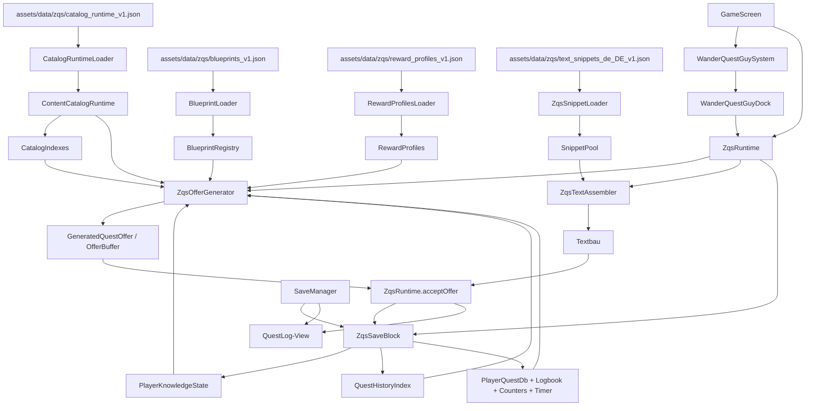

# ZQS / WQG MASTER-UMBAUPLAN — KANONISCHER EIN-DOKUMENT-PLAN

Ziel dieses Dokuments ist nicht eine weitere lose Analyse, sondern ein **einziger, kanonischer Umbauplan** für die vollständige Fertigstellung von:

- ZQS-Kern
- WQG-Docking
- Entscheidungslogik / Eligibility
- Generatoren
- Textsystem
- Save/Persistenz
- Quest-Historie / Logbuch
- Datenkataloge / Knowledge / Blueprints / Reward-Profile
- GameScreen / SaveManager / QuestLog / Legacy-View-Anbindung

Dieser Plan wurde auf Basis des **aktuellen Workspace-Zustands** aus `FUSA Story V0.091_1.zip` erstellt und mit den vorhandenen ZQS-Markdown-Dateien zusammengeführt.

Er ist absichtlich **kanonisch, hart und topologisch** aufgebaut. Eine KI mittlerer Klasse soll ihn **ohne freies Interpretieren** Abarbeiten können.

---

## 1. Harte Regeln

1. Nicht kompilieren.
2. Nicht starten.
3. Nicht debuggen.
4. Nicht committen.
5. Kein Scope-Creep.
6. Keine Ersatzsysteme neben ZQS.
7. `OfferBuffer` bleibt runtime-only und wird nie persistiert.
8. Kanonische Persistenz liegt unter Root-Key `zqs`.
9. `QuestLog` bleibt View-/Legacy-Schicht, nicht kanonischer Datenspeicher.
10. `WanderQuestGuySystem` bleibt Zusteller; Questlogik liegt nicht dort.
11. Für **neue Dateien** gilt: komplette Datei als Code anlegen.
12. Für **bestehende Dateien** gilt: nur präzise referenzierte Stellen ändern.
13. Wenn eine bestehende Legacy-Schicht nur noch als Kompatibilitätsbrücke existiert, wird sie nicht erweitert, sondern auf ZQS-Views reduziert.

---

## 2. Faktische Ausgangslage im aktuellen Code

Aktuell vorhanden:

- `quest/zqs/runtime/ZqsRuntime.java`
- `quest/zqs/generator/ZqsOfferGenerator.java`
- `quest/zqs/save/ZqsSaveBlock.java`
- `quest/zqs/save/ZqsSaveIO.java`
- `quest/zqs/text/*` (Snippet-Pool, Loader, Assembler)
- `quest/zqs/history/QuestHistoryIndex.java`
- `quest/zqs/dock/WanderQuestGuyDock.java`
- `systems/WanderQuestGuySystem.java`
- `GameScreen` bindet bereits `ZqsRuntime`, Dock und `ZqsSaveBlock`
- `SaveManager` schreibt/liest bereits `zqs`
- Asset-DBs sind bereits vorhanden:
  - `assets/data/zqs/catalog_runtime_v1.json`
  - `assets/data/zqs/blueprints_v1.json`
  - `assets/data/zqs/reward_profiles_v1.json`
  - `assets/data/zqs/text_snippets_de_DE_v1.json`

Aktuell **fehlend / nicht geschlossen**:

- `quest/zqs/catalog/*` Runtime-Katalogklassen
- `quest/zqs/knowledge/*`
- `quest/zqs/blueprint/*`
- Reward-Profile Loader/Registry
- Deterministische Quest-ID-Klasse
- Explizite Eligibility-Entscheidungsklasse
- Vollständige Runtime-Import-/Accept-Persistenzschließung
- Vollständige Text- und Placeholder-Härtung
- Vollständige Dummy-Abarbeitung
- Saubere Trennung von Legacy-View vs. kanonischem ZQS-Datensatz

Das heißt: Das Projekt ist **nicht bei 0%**, aber die Architektur ist **noch nicht geschlossen**. Es gibt bereits einen halben ZQS-Kern mit offenen Importen und offenen Dummies.

---

## 3. Zielarchitektur (Endzustand)



---

## 4. Topologischer Abarbeitungsgraph

Die Reihenfolge ist bindend. Knoten dürfen erst umgesetzt werden, wenn alle Abhängigkeiten erfüllt sind.

### N00 — Guardrails / Freeze
Abhängigkeiten: keine.

Ziel:
- Workflow-Regeln gelten.
- Keine Builds.
- Keine Nebenbaustellen.

### N01 — Runtime-Katalog schließen
Abhängigkeiten: N00.

Neue Dateien:
- `core/src/main/java/com/yourgame/survival/quest/zqs/catalog/CatalogKind.java`
- `core/src/main/java/com/yourgame/survival/quest/zqs/catalog/CatalogEntryRt.java`
- `core/src/main/java/com/yourgame/survival/quest/zqs/catalog/ContentCatalogRuntime.java`
- `core/src/main/java/com/yourgame/survival/quest/zqs/catalog/CatalogIndexes.java`
- `core/src/main/java/com/yourgame/survival/quest/zqs/catalog/CatalogRuntimeLoader.java`

Ergebnis:
- Alle generatorfähigen Ziele laufen ausschließlich über `ContentCatalogRuntime`.

### N02 — Known-State schließen
Abhängigkeiten: N01.

Neue Dateien:
- `core/src/main/java/com/yourgame/survival/quest/zqs/knowledge/PlayerKnowledgeState.java`
- `core/src/main/java/com/yourgame/survival/quest/zqs/knowledge/KnowledgeQuery.java`

Ergebnis:
- Known-State ist persistenter Save-Input und Filter der Generierung.

### N03 — Blueprint-Schicht schließen
Abhängigkeiten: N01.

Neue Dateien:
- `core/src/main/java/com/yourgame/survival/quest/zqs/blueprint/RepeatRules.java`
- `core/src/main/java/com/yourgame/survival/quest/zqs/blueprint/QuestBlueprint.java`
- `core/src/main/java/com/yourgame/survival/quest/zqs/blueprint/WeightedPicker.java`
- `core/src/main/java/com/yourgame/survival/quest/zqs/blueprint/BlueprintLoader.java`
- `core/src/main/java/com/yourgame/survival/quest/zqs/blueprint/BlueprintRegistry.java`

Ergebnis:
- Questvorlagen existieren als Registry statt Dummy.

### N04 — Entscheidungs- und Profil-Layer schließen
Abhängigkeiten: N01, N02, N03.

Neue Dateien:
- `core/src/main/java/com/yourgame/survival/quest/zqs/generator/ZqsGeneratorInputs.java`
- `core/src/main/java/com/yourgame/survival/quest/zqs/generator/EligibilityResult.java`
- `core/src/main/java/com/yourgame/survival/quest/zqs/generator/ZqsEligibility.java`
- `core/src/main/java/com/yourgame/survival/quest/zqs/generator/RewardProfileDef.java`
- `core/src/main/java/com/yourgame/survival/quest/zqs/generator/RewardProfiles.java`
- `core/src/main/java/com/yourgame/survival/quest/zqs/generator/RewardProfilesLoader.java`
- `core/src/main/java/com/yourgame/survival/quest/zqs/generator/ZqsQuestIdFactory.java`

Ergebnis:
- Entscheidungslogik, Reward-Profil-Layer und deterministische Quest-ID existieren als harte Klassen.

### N05 — Runtime-Datenobjekte härten
Abhängigkeiten: N04.

Bestehende Dateien:
- `core/src/main/java/com/yourgame/survival/quest/zqs/runtime/GeneratedQuestOffer.java`
- `core/src/main/java/com/yourgame/survival/quest/zqs/runtime/PersistentQuestRecord.java`
- `core/src/main/java/com/yourgame/survival/quest/zqs/runtime/TargetBlock.java`
- `core/src/main/java/com/yourgame/survival/quest/zqs/runtime/RewardBlock.java`

Ergebnis:
- Offer/Record/Target/Reward tragen alle Pflichtfelder.

### N06 — Text-Layer härten
Abhängigkeiten: N05.

Bestehende Dateien:
- `core/src/main/java/com/yourgame/survival/quest/zqs/text/ConversationContext.java`
- `core/src/main/java/com/yourgame/survival/quest/zqs/text/SnippetDef.java`
- `core/src/main/java/com/yourgame/survival/quest/zqs/text/SnippetPool.java`
- `core/src/main/java/com/yourgame/survival/quest/zqs/text/ZqsSnippetLoader.java`
- `core/src/main/java/com/yourgame/survival/quest/zqs/text/ZqsTextAssembler.java`

Ergebnis:
- Snippet-Filterung, Assignment/Reward/Farewell/Greeting laufen strikt nach Kontext.

### N07 — Generator von „teilweise“ auf „kanonisch“ hochziehen
Abhängigkeiten: N01–N06.

Bestehende Dateien:
- `core/src/main/java/com/yourgame/survival/quest/zqs/generator/RewardCalculator.java`
- `core/src/main/java/com/yourgame/survival/quest/zqs/generator/ZqsOfferGenerator.java`

Ergebnis:
- Eligibility → Blueprint → Target → Reward → QuestID → OfferBuffer ist geschlossen.

### N08 — Runtime-Import / Accept / Persistenz schließen
Abhängigkeiten: N06, N07.

Bestehende Dateien:
- `core/src/main/java/com/yourgame/survival/quest/zqs/runtime/ZqsRuntime.java`
- `core/src/main/java/com/yourgame/survival/quest/zqs/history/QuestHistoryIndex.java`
- `core/src/main/java/com/yourgame/survival/quest/zqs/history/QuestHistoryCodec.java`
- `core/src/main/java/com/yourgame/survival/quest/zqs/save/ZqsSaveBlock.java`
- `core/src/main/java/com/yourgame/survival/quest/zqs/save/ZqsSaveIO.java`

Ergebnis:
- Save-Block ist kanonisch, Import und Accept schreiben alle Pflichtblöcke.

### N09 — Dock / WQG schließen
Abhängigkeiten: N08.

Bestehende Dateien:
- `core/src/main/java/com/yourgame/survival/quest/zqs/dock/WanderQuestGuyDock.java`
- `core/src/main/java/com/yourgame/survival/systems/WanderQuestGuySystem.java`

Ergebnis:
- WQG ist nur Zusteller, nicht Questsystem.

### N10 — Legacy-View und Datenquellen angleichen
Abhängigkeiten: N08.

Bestehende Dateien:
- `core/src/main/java/com/yourgame/survival/data/ItemDef.java`
- `core/src/main/java/com/yourgame/survival/data/DataRegistry.java`
- `core/src/main/java/com/yourgame/survival/quest/QuestDef.java`
- `core/src/main/java/com/yourgame/survival/quest/QuestLog.java`

Ergebnis:
- Item-Tags sind in Runtime verfügbar, QuestDef/QuestLog bleiben nur View-/Legacy-Helfer.

### N11 — SaveManager / GameScreen binden und Legacy einfrieren
Abhängigkeiten: N08, N09, N10.

Bestehende Dateien:
- `core/src/main/java/com/yourgame/survival/data/SaveManager.java`
- `core/src/main/java/com/yourgame/survival/screens/GameScreen.java`

Ergebnis:
- `zqs` ist kanonisch, Legacy `questSys`/`questLog` bleiben nur Kompatibilität / View-Rebuild.

### N12 — Datenbank-Vollständigkeit / Snippet-DB Härte
Abhängigkeiten: N06, N07.

Bestehende Dateien:
- `assets/data/zqs/catalog_runtime_v1.json`
- `assets/data/zqs/blueprints_v1.json`
- `assets/data/zqs/reward_profiles_v1.json`
- `assets/data/zqs/text_snippets_de_DE_v1.json`

Ergebnis:
- Datenbank ist so vollständig, dass kein hartes Fehlen im Text- oder Generatorpfad auftritt.

### N13 — Abschluss-Audit ohne Build
Abhängigkeiten: N11, N12.

Ziel:
- Kein Dummy offen, der ZQS/WQG funktional blockiert.
- Keine fehlenden Imports mehr.
- Keine zweite kanonische Questhaltung neben `zqs`.

---

## 5. Patch-Matrix für bestehende Dateien

Diese Matrix benennt die **genauen Dateien** und **Ankerstellen**, die geändert werden müssen. Der eigentliche Code steht in den Anhängen dieses Dokuments.

### 5.1 `core/src/main/java/com/yourgame/survival/data/ItemDef.java`
Anker: Klassenkörper ab Zeile 3.

Pflichtänderung:
- Feld für Item-Tags ergänzen.

Ziel:
- `DataRegistry.loadItems()` muss JSON-Tags nach Runtime durchreichen können.

### 5.2 `core/src/main/java/com/yourgame/survival/data/DataRegistry.java`
Anker:
- `loadAll()` ab Zeile 21
- `loadItems(String path)` ab Zeile 29

Pflichtänderung:
- Tags aus `items.json` vollständig in `ItemDef` übernehmen.

### 5.3 `core/src/main/java/com/yourgame/survival/quest/QuestDef.java`
Anker:
- `byId(String id)` ab Zeile 53

Pflichtregel:
- `QuestDef` wird **nicht** zum zweiten kanonischen Questmodell ausgebaut.
- Es bleibt UI-/Legacy-Projektion.
- Beim Accept aus ZQS wird `QuestDef` aus Logbook/Record gebaut.

### 5.4 `core/src/main/java/com/yourgame/survival/quest/QuestLog.java`
Anker:
- Enum `Status`
- `acceptZqs(...)` ab Zeile 74

Pflichtregel:
- `QuestLog` bleibt View-Modell.
- Status-Mapping zu `finalStatus` wird sauber festgezogen.

### 5.5 `core/src/main/java/com/yourgame/survival/systems/WanderQuestGuySystem.java`
Anker:
- `importFromSave(...)` ab Zeile 66
- `onPopupOpened()` ab Zeile 185
- `acceptOffer(...)` ab Zeile 200

Pflichtänderungen:
- Keine Offer-Rekonstruktion aus Legacy-Save.
- ContextProvider bleibt GameScreen-getrieben.
- Accept geht ausschließlich über Dock.

### 5.6 `core/src/main/java/com/yourgame/survival/quest/zqs/dock/WanderQuestGuyDock.java`
Anker:
- `generateOffers(...)` ab Zeile 33
- `acceptOffer(...)` ab Zeile 49

Pflichtänderungen:
- `QuestDef`-View aus echtem ZQS-Record/Logbook aufbauen.
- Keine Platzhalter-QuestDefs.

### 5.7 `core/src/main/java/com/yourgame/survival/quest/zqs/generator/RewardCalculator.java`
Anker: Klassenkörper ab Zeile 12.

Pflichtänderungen:
- Rewardformeln exakt nach `zqs_reward_logik_referenz_v1.md`.
- `targetValueCopper` aus `TargetBlock`, nicht aus improvisierten Tags.
- `rewardTextMode` aus Reward-Profil, nicht hardcoded.

### 5.8 `core/src/main/java/com/yourgame/survival/quest/zqs/generator/ZqsOfferGenerator.java`
Anker: Klassenkörper ab Zeile 24.

Pflichtänderungen:
- Generator auf Catalog/Knowledge/Blueprint/RewardProfile/QuestHistory/QuestId-Fabrik verdrahten.
- NQ-Timer bleibt im `zqs`-Saveblock.
- Keine Legacy-Offer-IDs als kanonischer Zustand.

### 5.9 `core/src/main/java/com/yourgame/survival/quest/zqs/runtime/GeneratedQuestOffer.java`
Anker: Klassenkörper ab Zeile 4.

Pflichtänderungen:
- Pflichtfelder für `blueprintId`, `targetType`, ggf. `regionId`/weitere Kontextfelder sichern.

### 5.10 `core/src/main/java/com/yourgame/survival/quest/zqs/runtime/PersistentQuestRecord.java`
Anker: Klassenkörper ab Zeile 4.

Pflichtänderungen:
- Persistente Pflichtfelder aus Offer vollständig übernehmen.

### 5.11 `core/src/main/java/com/yourgame/survival/quest/zqs/runtime/TargetBlock.java`
Anker: Klassenkörper ab Zeile 7.

Pflichtänderungen:
- `targetValueCopper`, Roles, `regionId`, Known-/SL-State vollständig als Generatorinput tragen.

### 5.12 `core/src/main/java/com/yourgame/survival/quest/zqs/runtime/RewardBlock.java`
Anker:
- `RewardItem` ab Zeile 22
- `normalizeCurrency()` ab Zeile 31

Pflichtänderungen:
- Strukturierte RewardItems, Currency-Split, Reward-Metadaten und Penalty-Felder beibehalten/härten.

### 5.13 `core/src/main/java/com/yourgame/survival/quest/zqs/runtime/ZqsRuntime.java`
Anker:
- `bind(...)` ab Zeile 75
- `generateNqOffers(...)` ab Zeile 117
- `acceptOffer(...)` ab Zeile 167
- `buildGreeting(...)` ab Zeile 314

Pflichtänderungen:
- Runtime-Import aus Save schließen.
- Accept persistiert Record/Logbook/History atomar.
- Greeting/Assignment/Reward/Farewell laufen über Textengine.

### 5.14 `core/src/main/java/com/yourgame/survival/quest/zqs/text/ConversationContext.java`
Anker: Klassenkörper ab Zeile 9.

Pflichtänderungen:
- Alle Filterfelder aus `TEXT_ZQS.md` abbilden.

### 5.15 `core/src/main/java/com/yourgame/survival/quest/zqs/text/SnippetDef.java`
### 5.16 `core/src/main/java/com/yourgame/survival/quest/zqs/text/SnippetPool.java`
### 5.17 `core/src/main/java/com/yourgame/survival/quest/zqs/text/ZqsSnippetLoader.java`
### 5.18 `core/src/main/java/com/yourgame/survival/quest/zqs/text/ZqsTextAssembler.java`

Pflichtänderungen:
- Keine Fallback-Textgenerierung.
- Pflichtfilter exakt umsetzen.
- Placeholder nur aus instanziiertem Questdatensatz füllen.
- `assignment_na` strikt trennen.

### 5.19 `core/src/main/java/com/yourgame/survival/quest/zqs/history/QuestHistoryIndex.java`
### 5.20 `core/src/main/java/com/yourgame/survival/quest/zqs/history/QuestHistoryCodec.java`

Pflichtänderungen:
- History bleibt eigenständige Runtime-Repräsentation über SaveBlock.

### 5.21 `core/src/main/java/com/yourgame/survival/quest/zqs/save/ZqsSaveBlock.java`
### 5.22 `core/src/main/java/com/yourgame/survival/quest/zqs/save/ZqsSaveIO.java`

Pflichtänderungen:
- Save-Schema exakt nach `SAVE_ZQS.md`.
- `offerBuffer` bleibt ausgeschlossen.
- Optionaler `catalogSnapshot` nur falls tatsächlich benötigt.
- `nqTimerState` wird persistiert.

### 5.23 `core/src/main/java/com/yourgame/survival/screens/GameScreen.java`
Anker:
- New-Game Bindung Zeilen 678–714
- Runtime-Bindung Zeilen 1225–1228
- Load-Pfad Zeilen 7782–7817

Pflichtänderungen:
- ZQS-Bindung nur über `zqsRt` + Dock.
- ContextProvider einmalig sauber definieren.
- ZQS nicht doppelt initialisieren.

### 5.24 `core/src/main/java/com/yourgame/survival/data/SaveManager.java`
Anker:
- Write-Teil Zeilen 349–389
- Read-/View-Rebuild Zeilen 903–971

Pflichtänderungen:
- `zqs` ist kanonisch.
- Legacy `questSys` bleibt nur Übergangs-/Kompatibilitätsspeicher.
- `QuestLog` wird bevorzugt aus `zqs.logbook` rekonstruiert.

---

## 6. Kanonische Abarbeitungsreihenfolge als absolute Liste

1. N01 komplett.
2. N02 komplett.
3. N03 komplett.
4. N04 komplett.
5. N05 komplett.
6. N06 komplett.
7. N07 komplett.
8. N08 komplett.
9. N09 komplett.
10. N10 komplett.
11. N11 komplett.
12. N12 komplett.
13. N13 Audit.

Nicht erlaubt:
- N08 vor N01–N07 teilweise „hinflicken“.
- WQG zuerst „funktionsfähig machen“ und den Unterbau später nachziehen.
- Textengine improvisieren, solange Snippet-DB nicht vollständig genug ist.

---

## 7. Definition of Done

Der Umbau ist erst fertig, wenn alle folgenden Punkte gleichzeitig wahr sind:

- Keine fehlenden Imports mehr in `quest/zqs/*`.
- `ZqsRuntime` kann alle benötigten Kataloge/Blueprints/Reward-Profile/Text-Snippets laden.
- Generator zieht ausschließlich aus `ContentCatalogRuntime`.
- Known-State filtert generatorrelevante Ziele.
- Accept schreibt `playerQuestDb`, `logbook`, `questHistoryIndex`, `counters`, `nqTimerState` korrekt fort.
- `QuestLog` wird nur noch aus `zqs`-Daten als View gespeist.
- `WanderQuestGuySystem` erzeugt keine eigene Questlogik mehr.
- Keine blocker-relevanten Dummies mehr offen.
- Snippet-DB ist vollständig genug für alle aktuell freigegebenen Questtypen.

---

## 8. Anhänge

Ab hier folgen die **kanonischen Detailpläne und Codeblöcke**, direkt aus den im Workspace vorhandenen ZQS-Planungsdateien zusammengeführt. Diese Anhänge sind Bestandteil dieses Dokuments.


---

# ANHANG — PLAN_ZQS_MODULE_01_CATALOG.md

# PLAN — Modul 01: `quest/zqs/catalog/*` (ContentCatalogRuntime)

> Ziel: Dummy-Replacement für Struktur-Dummies **(101)** + Grundlage für Generator-Eligibility (Known/SL_ID/Tags/ValueCopper).
>
> Quelle/Autorität:
> - Master: `flow 4/zqs_master_alignment_v_1_1.md`
> - Soll-Modell: `MODEL_ZQS.md` (02.01)
> - Generator-Regeln: `GENERATOR_ZQS.md` (04.01–04.02)
>
> Harte Regeln:
> - Generator arbeitet **nur** auf `ContentCatalogRuntime`.
> - Keine Fallback-Systeme: Missing DB/Entry → Exception.

---

## 1) Dateien/Packages (neu)

Pfad (neu):
- `core/src/main/java/com/yourgame/survival/quest/zqs/catalog/`

Neue Klassen:
1. `CatalogKind.java`
2. `CatalogEntryRt.java`
3. `ContentCatalogRuntime.java`
4. `CatalogRuntimeLoader.java`
5. `CatalogIndexes.java`

> Diese Klassen ersetzen nicht sofort `ZqsDb`, aber werden als **kanonische** Runtime-Katalog-API genutzt, sobald generator/* Pipeline aktiv wird.

---

## 2) Exakter Datenvertrag (Input)

DB-Quelle bleibt:
- `assets/data/zqs/catalog_runtime_v1.json`

Erwartete Arrays:
- resources/items/harvestables/livings/pois/npcs/regions

Erwartete Felder pro Entry (MODEL_ZQS.md):
- `kind` (implizit durch Array)
- `id` (string) **oder** numeric itemId
- `name` (string)
- `tags` (string[])
- `valueCopper` (int)
- `slIdMax` (int)
- `knownRequired` (bool)
- `itemId` (int) für Items/Resources (optional: wenn id numerisch)

**Normierung:**
- `entry.key()` ist stabiler String-Key:  
  - wenn `id` non-empty → `id`  
  - else wenn `itemId >= 0` → `String.valueOf(itemId)`

---

## 3) Copy/Paste Code (vollständige Klassen)

### 3.1 `CatalogKind.java`

```java
package com.yourgame.survival.quest.zqs.catalog;

public enum CatalogKind {
  RESOURCE("resource"),
  ITEM("item"),
  HARVESTABLE("harvestable"),
  LIVING("living"),
  POI("poi"),
  NPC("npc"),
  REGION("region");

  public final String id;
  CatalogKind(String id) { this.id = id; }

  public static CatalogKind byId(String id) {
    if (id == null) return null;
    for (CatalogKind k : values()) if (k.id.equals(id)) return k;
    return null;
  }
}
```

### 3.2 `CatalogEntryRt.java`

```java
package com.yourgame.survival.quest.zqs.catalog;

import java.util.ArrayList;
import java.util.List;

public final class CatalogEntryRt {
  public CatalogKind kind;
  public String id = "";
  public int itemId = -1;
  public String name = "";
  public int valueCopper = 0;
  public int slIdMax = 0;
  public boolean knownRequired = false;
  public final List<String> tags = new ArrayList<>();

  public String key() {
    if (id != null && !id.isEmpty()) return id;
    if (itemId >= 0) return String.valueOf(itemId);
    return "";
  }

  public boolean isValid() {
    return kind != null && key() != null && !key().isEmpty();
  }

  public boolean hasTag(String tag) {
    if (tag == null || tag.isEmpty()) return false;
    for (String t : tags) if (tag.equals(t)) return true;
    return false;
  }
}
```

### 3.3 `ContentCatalogRuntime.java`

```java
package com.yourgame.survival.quest.zqs.catalog;

import java.util.ArrayList;
import java.util.Collections;
import java.util.List;

public final class ContentCatalogRuntime {

  public final List<CatalogEntryRt> resources = new ArrayList<>();
  public final List<CatalogEntryRt> items = new ArrayList<>();
  public final List<CatalogEntryRt> harvestables = new ArrayList<>();
  public final List<CatalogEntryRt> livings = new ArrayList<>();
  public final List<CatalogEntryRt> pois = new ArrayList<>();
  public final List<CatalogEntryRt> npcs = new ArrayList<>();
  public final List<CatalogEntryRt> regions = new ArrayList<>();

  public void clear() {
    resources.clear();
    items.clear();
    harvestables.clear();
    livings.clear();
    pois.clear();
    npcs.clear();
    regions.clear();
  }

  public List<CatalogEntryRt> listByKind(CatalogKind kind) {
    if (kind == null) return Collections.emptyList();
    return switch (kind) {
      case RESOURCE -> resources;
      case ITEM -> items;
      case HARVESTABLE -> harvestables;
      case LIVING -> livings;
      case POI -> pois;
      case NPC -> npcs;
      case REGION -> regions;
    };
  }
}
```

### 3.4 `CatalogIndexes.java`

```java
package com.yourgame.survival.quest.zqs.catalog;

import java.util.HashMap;

public final class CatalogIndexes {
  public final HashMap<String, CatalogEntryRt> byKey = new HashMap<>();

  public void clear() { byKey.clear(); }

  public void index(ContentCatalogRuntime cat) {
    clear();
    if (cat == null) return;
    indexList(cat.resources);
    indexList(cat.items);
    indexList(cat.harvestables);
    indexList(cat.livings);
    indexList(cat.pois);
    indexList(cat.npcs);
    indexList(cat.regions);
  }

  private void indexList(java.util.List<CatalogEntryRt> list) {
    if (list == null) return;
    for (CatalogEntryRt e : list) {
      if (e == null || !e.isValid()) continue;
      byKey.put(e.key(), e);
    }
  }

  public CatalogEntryRt get(String key) {
    if (key == null || key.isEmpty()) return null;
    return byKey.get(key);
  }
}
```

### 3.5 `CatalogRuntimeLoader.java`

```java
package com.yourgame.survival.quest.zqs.catalog;

import com.badlogic.gdx.Gdx;
import com.badlogic.gdx.files.FileHandle;
import com.badlogic.gdx.utils.JsonReader;
import com.badlogic.gdx.utils.JsonValue;

public final class CatalogRuntimeLoader {

  public ContentCatalogRuntime load(String internalPath) {
    if (internalPath == null || internalPath.isEmpty()) {
      throw new IllegalArgumentException("catalog path missing");
    }

    JsonValue root = parseInternal(internalPath);
    ContentCatalogRuntime out = new ContentCatalogRuntime();

    readArray(root, "resources", CatalogKind.RESOURCE, out);
    readArray(root, "items", CatalogKind.ITEM, out);
    readArray(root, "harvestables", CatalogKind.HARVESTABLE, out);
    readArray(root, "livings", CatalogKind.LIVING, out);
    readArray(root, "pois", CatalogKind.POI, out);
    readArray(root, "npcs", CatalogKind.NPC, out);
    readArray(root, "regions", CatalogKind.REGION, out);

    // strict: empty catalog is a data error
    if (out.items.isEmpty() && out.resources.isEmpty() && out.harvestables.isEmpty()) {
      throw new IllegalStateException("CatalogRuntime is empty: " + internalPath);
    }

    return out;
  }

  private static void readArray(JsonValue root, String key, CatalogKind kind, ContentCatalogRuntime out) {
    if (root == null) throw new IllegalStateException("catalog root missing");
    JsonValue arr = root.get(key);
    if (arr == null) return; // arrays optional per current db loader, but content may be empty

    java.util.List<CatalogEntryRt> list = out.listByKind(kind);
    for (JsonValue e = arr.child; e != null; e = e.next) {
      CatalogEntryRt ce = new CatalogEntryRt();
      ce.kind = kind;

      // Allow numeric id or string id
      ce.itemId = e.getInt("id", -1);
      ce.id = e.getString("id", "");
      ce.name = e.getString("name", "");
      ce.valueCopper = e.getInt("valueCopper", e.getInt("value", 0));
      ce.slIdMax = e.getInt("slIdMax", 0);
      ce.knownRequired = e.getBoolean("knownRequired", false);

      JsonValue tags = e.get("tags");
      if (tags != null) {
        for (JsonValue tv = tags.child; tv != null; tv = tv.next) {
          String t = tv.asString();
          if (t != null && !t.isEmpty()) ce.tags.add(t);
        }
      }

      if (!ce.isValid()) {
        throw new IllegalStateException("Invalid catalog entry in " + key + ": id/itemId missing");
      }
      list.add(ce);
    }
  }

  private static JsonValue parseInternal(String path) {
    try {
      FileHandle fh = Gdx.files.internal(path);
      if (fh == null || !fh.exists()) throw new RuntimeException("Missing catalog file: " + path);
      return new JsonReader().parse(fh);
    } catch (Throwable t) {
      throw (t instanceof RuntimeException) ? (RuntimeException) t : new RuntimeException(t);
    }
  }
}
```

---

## 4) Einbau-Anweisungen (später, wenn umgesetzt wird)

1) Generatorpipeline benutzt künftig:
- `ContentCatalogRuntime cat = new CatalogRuntimeLoader().load("data/zqs/catalog_runtime_v1.json");`
- `CatalogIndexes idx = new CatalogIndexes(); idx.index(cat);`

2) `TargetBlock.targetValueCopper` wird direkt aus `CatalogEntryRt.valueCopper` gesetzt (ersetzt DUMMY 402).

3) KnownRequired/SL_ID Filter:
- `knownRequired` wird gegen Save-Knowledge geprüft (siehe Modul 02).
- `slIdMax > playerSlId` → verwerfen.

---

## 5) Dummy-Abdeckung

- (101) ContentCatalogAsset: **noch nicht** (dieses Modul ist RuntimeCatalog). AssetCatalog kommt später, wenn Textpools Aliase brauchen.
- (102) Knowledge: siehe Modul 02.
- (104) Generatorpipeline: siehe Modul 04.


---

# ANHANG — PLAN_ZQS_MODULE_02_KNOWLEDGE.md

# PLAN — Modul 02: `quest/zqs/knowledge/*` (PlayerKnowledgeState)

> Ziel: Dummy-Replacement für Struktur-Dummy **(102)** + harte Known-State Regeln aus Master.
>
> Autorität:
> - `flow 4/zqs_master_alignment_v_1_1.md` (Block 2)
> - `MODEL_ZQS.md` (02.02)
> - Persistenz: `SAVE_ZQS.md` (knowledge)

> Harte Regeln:
> - Known-State ist **persistenter Save-Block** und wird **nie** rekonstruiert.
> - Generator darf Ziele mit `knownRequired=true` nur wählen, wenn Known-State das Ziel enthält.

---

## 1) Dateien/Packages (neu)

Pfad (neu):
- `core/src/main/java/com/yourgame/survival/quest/zqs/knowledge/`

Neue Klassen:
1) `PlayerKnowledgeState.java` (Runtime View / Wrapper)
2) `KnowledgeQuery.java` (Helper)

> Persistenz bleibt weiterhin in `ZqsSaveBlock.Knowledge`.

---

## 2) Copy/Paste Code

### 2.1 `PlayerKnowledgeState.java`

```java
package com.yourgame.survival.quest.zqs.knowledge;

import com.yourgame.survival.quest.zqs.catalog.CatalogKind;
import com.yourgame.survival.quest.zqs.save.ZqsSaveBlock;

import java.util.HashSet;

/**
 * Runtime wrapper over persisted save knowledge.
 * Canonical storage remains in ZqsSaveBlock.knowledge.
 */
public final class PlayerKnowledgeState {

  private final HashSet<Integer> knownItems = new HashSet<>();
  private final HashSet<String> knownRegions = new HashSet<>();
  private final HashSet<String> knownHarvestables = new HashSet<>();
  private final HashSet<String> knownLivings = new HashSet<>();
  private final HashSet<String> knownPois = new HashSet<>();
  private final HashSet<String> knownNpcs = new HashSet<>();

  public void clear() {
    knownItems.clear();
    knownRegions.clear();
    knownHarvestables.clear();
    knownLivings.clear();
    knownPois.clear();
    knownNpcs.clear();
  }

  public void importFromSave(ZqsSaveBlock save) {
    clear();
    if (save == null || save.knowledge == null) return;

    if (save.knowledge.knownItems != null) knownItems.addAll(save.knowledge.knownItems);
    if (save.knowledge.knownRegions != null) knownRegions.addAll(save.knowledge.knownRegions);
    if (save.knowledge.knownHarvestables != null) knownHarvestables.addAll(save.knowledge.knownHarvestables);
    if (save.knowledge.knownLivings != null) knownLivings.addAll(save.knowledge.knownLivings);
    if (save.knowledge.knownPois != null) knownPois.addAll(save.knowledge.knownPois);
    if (save.knowledge.knownNpcs != null) knownNpcs.addAll(save.knowledge.knownNpcs);
  }

  /**
   * Key-based check used by generator after it selected a CatalogEntry.
   * For non-items, key is string id.
   */
  public boolean isKnown(CatalogKind kind, String key) {
    if (kind == null) return false;
    if (key == null || key.isEmpty()) return false;

    return switch (kind) {
      case ITEM, RESOURCE -> {
        try { yield knownItems.contains(Integer.parseInt(key)); }
        catch (Throwable t) { yield false; }
      }
      case REGION -> knownRegions.contains(key);
      case HARVESTABLE -> knownHarvestables.contains(key);
      case LIVING -> knownLivings.contains(key);
      case POI -> knownPois.contains(key);
      case NPC -> knownNpcs.contains(key);
    };
  }
}
```

### 2.2 `KnowledgeQuery.java`

```java
package com.yourgame.survival.quest.zqs.knowledge;

import com.yourgame.survival.quest.zqs.catalog.CatalogEntryRt;

public final class KnowledgeQuery {
  private KnowledgeQuery() {}

  public static boolean passesKnownGate(PlayerKnowledgeState k, CatalogEntryRt e) {
    if (e == null) return false;
    if (!e.knownRequired) return true;
    if (k == null) return false;
    return k.isKnown(e.kind, e.key());
  }
}
```

---

## 3) Einbau-Anweisungen (später)

- In `ZqsRuntime.bind(...)` (DUMMY 701) wird zusätzlich `PlayerKnowledgeState.importFromSave(save)` gemacht.
- Generatorpipeline (Modul 04) nutzt `KnowledgeQuery.passesKnownGate(...)` in Filterkette Schritt 4.

---

## 4) Dummy-Abdeckung

- (102) PlayerKnowledgeState: vollständig.
- Verhindert Fallback: KnownRequired ohne Known -> Ziel wird **verworfen** (nicht „trotzdem“).


---

# ANHANG — PLAN_ZQS_MODULE_03_BLUEPRINTS.md

# PLAN — Modul 03: `quest/zqs/blueprint/*` (BlueprintRegistry + Eligibility)

> Ziel: Dummy-Replacement für Struktur-Dummy **(103)** + Basis für Generator Schritt 2/8 (filtern + weighted select).
>
> Autorität:
> - `MODEL_ZQS.md` (02.03 Blueprint)
> - `GENERATOR_ZQS.md` (04.02 Schritte 2/8)
> - Master Alignment: Blueprint-Auswahl nur nach Filter.

---

## 1) Dateien/Packages (neu)

Pfad (neu):
- `core/src/main/java/com/yourgame/survival/quest/zqs/blueprint/`

Neue Klassen:
1) `QuestBlueprint.java`
2) `RepeatRules.java`
3) `BlueprintRegistry.java`
4) `BlueprintLoader.java`
5) `WeightedPicker.java`

---

## 2) Copy/Paste Code

### 2.1 `RepeatRules.java`

```java
package com.yourgame.survival.quest.zqs.blueprint;

public final class RepeatRules {
  public int cooldownHours = 0;
  public boolean denySameTarget = false;
  public boolean denySameFamily = false;
}
```

### 2.2 `QuestBlueprint.java`

```java
package com.yourgame.survival.quest.zqs.blueprint;

public final class QuestBlueprint {
  public String blueprintId = "";
  public String objectiveFamily = "NQ"; // NQ|HQ
  public String questType = "";
  public String questSubtype = "";

  public String[] allowedTargetKinds = new String[0];

  public int amountMin = 1;
  public int amountMax = 1;

  public int minPlayerLevel = 1;
  public Integer maxPlayerLevel = null;

  public float weight = 1.0f;

  public String rewardProfileId = "";
  public String textProfileId = "";

  public final RepeatRules repeatRules = new RepeatRules();
}
```

### 2.3 `WeightedPicker.java`

```java
package com.yourgame.survival.quest.zqs.blueprint;

import java.util.ArrayList;

public final class WeightedPicker {
  private long rng;

  public WeightedPicker(long seed) {
    rng = (seed != 0L) ? seed : 0x9E3779B97F4A7C15L;
  }

  public <T> T pick(ArrayList<T> list, WeightFn<T> fn) {
    if (list == null || list.isEmpty()) return null;
    float sum = 0f;
    for (int i = 0; i < list.size(); i++) {
      T e = list.get(i);
      float w = (fn != null) ? fn.weightOf(e) : 1f;
      if (w > 0f) sum += w;
    }
    if (sum <= 0f) return null;

    float r = nextFloat01() * sum;
    float acc = 0f;
    for (int i = 0; i < list.size(); i++) {
      T e = list.get(i);
      float w = (fn != null) ? fn.weightOf(e) : 1f;
      if (w <= 0f) continue;
      acc += w;
      if (r <= acc) return e;
    }
    return list.get(0);
  }

  public interface WeightFn<T> { float weightOf(T t); }

  private long nextLong() {
    long x = rng;
    x ^= x >>> 12;
    x ^= x << 25;
    x ^= x >>> 27;
    rng = x;
    return x * 2685821657736338717L;
  }

  private float nextFloat01() {
    return ((nextLong() >>> 40) & 0xFFFFFFL) / (float) (1 << 24);
  }
}
```

### 2.4 `BlueprintLoader.java`

```java
package com.yourgame.survival.quest.zqs.blueprint;

import com.badlogic.gdx.Gdx;
import com.badlogic.gdx.files.FileHandle;
import com.badlogic.gdx.utils.JsonReader;
import com.badlogic.gdx.utils.JsonValue;

import java.util.ArrayList;

public final class BlueprintLoader {

  public ArrayList<QuestBlueprint> load(String internalPath) {
    if (internalPath == null || internalPath.isEmpty()) throw new IllegalArgumentException("path missing");

    JsonValue root = parseInternal(internalPath);
    JsonValue arr = root.get("blueprints");
    if (arr == null) throw new IllegalStateException("blueprints array missing: " + internalPath);

    ArrayList<QuestBlueprint> out = new ArrayList<>();

    for (JsonValue b = arr.child; b != null; b = b.next) {
      QuestBlueprint bp = new QuestBlueprint();
      bp.blueprintId = b.getString("blueprintId", "");
      bp.objectiveFamily = b.getString("objectiveFamily", "NQ");
      bp.questType = b.getString("questType", "");
      bp.questSubtype = b.getString("questSubtype", "");
      bp.minPlayerLevel = b.getInt("minPlayerLevel", 1);
      if (b.has("maxPlayerLevel")) {
        try { bp.maxPlayerLevel = b.getInt("maxPlayerLevel"); } catch (Throwable ignored) { bp.maxPlayerLevel = null; }
      }
      bp.weight = (float) b.getDouble("weight", 1.0);
      bp.rewardProfileId = b.getString("rewardProfileId", "");
      bp.textProfileId = b.getString("textProfileId", "");

      JsonValue at = b.get("allowedTargetKinds");
      if (at != null) {
        String[] ks = new String[at.size];
        int i = 0;
        for (JsonValue k = at.child; k != null; k = k.next) ks[i++] = k.asString();
        bp.allowedTargetKinds = ks;
      }

      JsonValue ar = b.get("amountRules");
      if (ar != null) {
        bp.amountMin = ar.getInt("min", 1);
        bp.amountMax = ar.getInt("max", bp.amountMin);
      }

      JsonValue rr = b.get("repeatRules");
      if (rr != null) {
        bp.repeatRules.cooldownHours = rr.getInt("cooldownHours", 0);
        bp.repeatRules.denySameTarget = rr.getBoolean("denySameTarget", false);
        bp.repeatRules.denySameFamily = rr.getBoolean("denySameFamily", false);
      }

      if (bp.blueprintId == null || bp.blueprintId.isEmpty()) {
        throw new IllegalStateException("Blueprint missing blueprintId");
      }

      out.add(bp);
    }

    if (out.isEmpty()) throw new IllegalStateException("No blueprints loaded from: " + internalPath);
    return out;
  }

  private static JsonValue parseInternal(String path) {
    try {
      FileHandle fh = Gdx.files.internal(path);
      if (fh == null || !fh.exists()) throw new RuntimeException("Missing blueprint file: " + path);
      return new JsonReader().parse(fh);
    } catch (Throwable t) {
      throw (t instanceof RuntimeException) ? (RuntimeException) t : new RuntimeException(t);
    }
  }
}
```

### 2.5 `BlueprintRegistry.java`

```java
package com.yourgame.survival.quest.zqs.blueprint;

import java.util.ArrayList;
import java.util.HashMap;

public final class BlueprintRegistry {

  public final ArrayList<QuestBlueprint> all = new ArrayList<>();
  public final HashMap<String, QuestBlueprint> byId = new HashMap<>();

  public void clear() {
    all.clear();
    byId.clear();
  }

  public void loadFrom(ArrayList<QuestBlueprint> list) {
    clear();
    if (list == null || list.isEmpty()) throw new IllegalStateException("Blueprint list empty");
    for (QuestBlueprint bp : list) {
      if (bp == null) continue;
      if (bp.blueprintId == null || bp.blueprintId.isEmpty()) continue;
      all.add(bp);
      byId.put(bp.blueprintId, bp);
    }
    if (all.isEmpty()) throw new IllegalStateException("No valid blueprints indexed");
  }

  public ArrayList<QuestBlueprint> filter(String family, int playerLevel) {
    ArrayList<QuestBlueprint> out = new ArrayList<>();
    for (QuestBlueprint bp : all) {
      if (bp == null) continue;
      if (family != null && !family.isEmpty() && !family.equals(bp.objectiveFamily)) continue;
      if (playerLevel < bp.minPlayerLevel) continue;
      if (bp.maxPlayerLevel != null && playerLevel > bp.maxPlayerLevel) continue;
      out.add(bp);
    }
    return out;
  }
}
```

---

## 3) Einbau-Anweisungen (später)

- Generatorpipeline lädt:
  - `BlueprintLoader().load("data/zqs/blueprints_v1.json")`
  - `BlueprintRegistry.loadFrom(...)`
- Schritt 2: `registry.filter(family, playerLevel)`
- Schritt 8: `WeightedPicker.pick(eligible, bp -> bp.weight)`

---

## 4) Dummy-Abdeckung

- (103) BlueprintLoader/Registry: vollständig.
- Legacy Dummy (001) in `ZqsSystem` wird dadurch perspektivisch obsolet (Pipeline ersetzt Monolith).


---

# ANHANG — PLAN_ZQS_MODULE_04_GENERATOR_PIPELINE.md

# PLAN — Modul 04: `quest/zqs/generator/*` (Pipeline, deterministische QuestID, RepeatRules)

> Ziel: Dummy-Replacement für Struktur-Dummy **(104)** + die konzeptuellen Monolith-Dummies **(001–006)**, indem der Monolith Schritt für Schritt durch die Pipeline ersetzt wird.
>
> Autorität:
> - `GENERATOR_ZQS.md` (Filterkette + QuestID)
> - `flow 4/zqs_master_alignment_v_1_1.md` (Stufen/Trennlinien)
> - Reward: `flow 4/zqs_reward_logik_referenz_v1.md`
>
> Harte Regeln:
> - Generator arbeitet nur auf `ContentCatalogRuntime`.
> - OfferBuffer ist runtime-only.
> - Nicht angenommene NQ: keine Persistenz, keine History.

---

## 1) Dateien/Packages (neu/ergänzend)

Pfad:
- `core/src/main/java/com/yourgame/survival/quest/zqs/generator/`

Neue Klassen (v1, vollständig skizzierbar):
1) `ZqsGeneratorInputs.java`
2) `EligibilityResult.java`
3) `ZqsEligibility.java`
4) `ZqsTargetSelector.java`
5) `ZqsQuestIdFactory.java`
6) `ZqsOfferGenerator.java`
7) `RepeatRulesGate.java`
8) `RewardProfileDef.java` + `RewardProfilesLoader.java`

> Existierend: `RewardCalculator` (hat DUMMY 402/403), `QuestBlueprintDef` (existiert), `TargetBlock` (existiert).

---

## 2) Exakte Pipeline (GENERATOR_ZQS.md 04.02) als Code-Struktur

### Stufe A: Inputs normalisieren
- playerLevel
- playerSlId (StoryLinePhase) — **muss** aus Save/Progress kommen (wenn noch nicht vorhanden: DUMMY im StoryState, nicht hier raten)
- knowledge (importiert aus save)
- runtime catalog + indexes
- questHistoryIndex (importiert aus save)
- openQuestsCount/completedQuestsCount
- runtimeSec
- counters (quest_nr_counter)

### Stufe B: Eligibility + Blueprint Filter
- family check (NQ/HQ)
- timer/cap (NQ)
- blueprint candidates (family + level)

### Stufe C: Target Selection
- allowedTargetKinds → map zu `CatalogKind`
- build candidates list (catalog entries)
- filter knownRequired
- filter slIdMax <= playerSlId
- filter repeat rules / active conflict

### Stufe D: Instantiate Quest
- amount
- expectedTimeSec
- reward
- text ids
- deterministic questId

---

## 3) Copy/Paste Code — Kernklassen

### 3.1 `ZqsGeneratorInputs.java`

```java
package com.yourgame.survival.quest.zqs.generator;

import com.yourgame.survival.quest.zqs.blueprint.BlueprintRegistry;
import com.yourgame.survival.quest.zqs.catalog.CatalogIndexes;
import com.yourgame.survival.quest.zqs.catalog.ContentCatalogRuntime;
import com.yourgame.survival.quest.zqs.history.QuestHistoryIndex;
import com.yourgame.survival.quest.zqs.knowledge.PlayerKnowledgeState;
import com.yourgame.survival.quest.zqs.save.ZqsSaveBlock;

public final class ZqsGeneratorInputs {
  public int playerLevel = 1;
  public int playerSlId = 1;

  public long runtimeSec = 0;

  public int openQuestsCount = 0;
  public int completedQuestsCount = 0;

  public PlayerKnowledgeState knowledge;
  public ContentCatalogRuntime catalog;
  public CatalogIndexes catalogIdx;
  public QuestHistoryIndex history;

  public BlueprintRegistry blueprints;

  public RewardProfiles profiles;

  public ZqsSaveBlock save; // for counters/logbook updates at accept-time (not generation)
}
```

### 3.2 `EligibilityResult.java`

```java
package com.yourgame.survival.quest.zqs.generator;

public final class EligibilityResult {
  public boolean ok = true;
  public String naReason = "";     // rolled_zero|cap_reached|no_valid_targets|timer_reset|...
  public String blockReason = "none"; // none|cap_reached|no_valid_targets|timer_not_due|...
}
```

### 3.3 `ZqsEligibility.java`

```java
package com.yourgame.survival.quest.zqs.generator;

public final class ZqsEligibility {

  // v1: only NQ; HQ gating is reserved.
  public EligibilityResult checkNq(ZqsGeneratorInputs in) {
    EligibilityResult r = new EligibilityResult();
    if (in == null) throw new IllegalArgumentException("inputs missing");

    // Cap example (GENERATOR_ZQS.md step1) — exact cap value is project rule; if unknown, wire from config.
    // We keep it explicit to avoid hidden behavior.
    int cap = 10;
    if (in.openQuestsCount > cap) {
      r.ok = false;
      r.naReason = "cap_reached";
      r.blockReason = "cap_reached";
      return r;
    }

    // Timer_not_due: only if there is a persisted NQ timer. (Not yet modeled in save -> leave ok.)
    return r;
  }
}
```

### 3.4 Reward Profiles (replaces DUMMY 403 input-side)

#### `RewardProfileDef.java`

```java
package com.yourgame.survival.quest.zqs.generator;

public final class RewardProfileDef {
  public String rewardProfileId = "";
  public String rewardFormulaType = "";
  public String rewardTextMode = "currency";
  public boolean allowItemRewards = false;
  public boolean allowCurrencyRewards = true;
  public boolean allowMixedRewards = false;
}
```

#### `RewardProfiles.java`

```java
package com.yourgame.survival.quest.zqs.generator;

import java.util.HashMap;

public final class RewardProfiles {
  public final HashMap<String, RewardProfileDef> byId = new HashMap<>();
  public RewardProfileDef get(String id) { return (id == null) ? null : byId.get(id); }
}
```

#### `RewardProfilesLoader.java`

```java
package com.yourgame.survival.quest.zqs.generator;

import com.badlogic.gdx.Gdx;
import com.badlogic.gdx.files.FileHandle;
import com.badlogic.gdx.utils.JsonReader;
import com.badlogic.gdx.utils.JsonValue;

public final class RewardProfilesLoader {

  public RewardProfiles load(String internalPath) {
    if (internalPath == null || internalPath.isEmpty()) throw new IllegalArgumentException("path missing");
    JsonValue root = parseInternal(internalPath);

    RewardProfiles out = new RewardProfiles();
    JsonValue arr = root.get("profiles");
    if (arr == null) throw new IllegalStateException("profiles array missing: " + internalPath);

    for (JsonValue p = arr.child; p != null; p = p.next) {
      RewardProfileDef rp = new RewardProfileDef();
      rp.rewardProfileId = p.getString("rewardProfileId", "");
      rp.rewardFormulaType = p.getString("rewardFormulaType", "");
      rp.rewardTextMode = p.getString("rewardTextMode", "currency");
      rp.allowItemRewards = p.getBoolean("allowItemRewards", false);
      rp.allowCurrencyRewards = p.getBoolean("allowCurrencyRewards", true);
      rp.allowMixedRewards = p.getBoolean("allowMixedRewards", false);
      if (rp.rewardProfileId == null || rp.rewardProfileId.isEmpty()) {
        throw new IllegalStateException("RewardProfile missing rewardProfileId");
      }
      out.byId.put(rp.rewardProfileId, rp);
    }

    if (out.byId.isEmpty()) throw new IllegalStateException("No reward profiles loaded: " + internalPath);
    return out;
  }

  private static JsonValue parseInternal(String path) {
    try {
      FileHandle fh = Gdx.files.internal(path);
      if (fh == null || !fh.exists()) throw new RuntimeException("Missing reward profiles file: " + path);
      return new JsonReader().parse(fh);
    } catch (Throwable t) {
      throw (t instanceof RuntimeException) ? (RuntimeException) t : new RuntimeException(t);
    }
  }
}
```

### 3.5 `ZqsQuestIdFactory.java` (deterministisch)

**Autorität:**
- `GENERATOR_ZQS.md` (04.03)
- `zqs_wander_quest_guy_plan1.0.md` (QuestID: `[typ][Stressfaktor][StorylinePhase][Questnr][Spielername]`)

**Normierung im Codeplan:**
- Wir erzeugen deterministisch aus Kernparametern + `quest_nr_counter`.
- Stressfaktor ist plan-seitig an HQ/Weltstress gekoppelt; solange das nicht implementiert ist, wird er **nicht erfunden**.
- Daher: v1 ID nutzt: `typ + SL_ID + QNR + P0` und zusätzlich Hash-Segmente für Blueprint/Target (damit identische QNR nicht kollidiert, falls Counter reset).

```java
package com.yourgame.survival.quest.zqs.generator;

public final class ZqsQuestIdFactory {
  private ZqsQuestIdFactory() {}

  public static String buildNqId(int slId, int questNrCounter, String playerTag,
                                String blueprintId, String targetType, String targetId, int amount) {

    String typ = "NQ";
    String sl = String.valueOf(Math.max(0, slId));
    String qnr = pad5(Math.max(0, questNrCounter));
    String p = (playerTag != null && !playerTag.isEmpty()) ? playerTag : "P0";

    String h1 = hex4(fnv1a32(blueprintId));
    String h2 = hex4(fnv1a32(targetType + ":" + targetId + ":" + amount));

    return typ + sl + h1 + h2 + qnr + p;
  }

  private static String pad5(int n) {
    String s = String.valueOf(n);
    if (s.length() >= 5) return s;
    StringBuilder sb = new StringBuilder();
    for (int i = s.length(); i < 5; i++) sb.append('0');
    sb.append(s);
    return sb.toString();
  }

  private static int fnv1a32(String s) {
    int h = 0x811C9DC5;
    if (s == null) return h;
    for (int i = 0; i < s.length(); i++) {
      h ^= (s.charAt(i) & 0xff);
      h *= 0x01000193;
    }
    return h;
  }

  private static String hex4(int v) {
    int x = v;
    char[] out = new char[4];
    for (int i = 3; i >= 0; i--) {
      int n = x & 0xF;
      out[i] = (char) (n < 10 ? ('0' + n) : ('A' + (n - 10)));
      x >>>= 4;
    }
    return new String(out);
  }
}
```

---

## 4) Wie ersetzt das die Legacy-Dummies 001–006?

- (001) Blueprint DB: ersetzt durch Modul 03 + Registry.
- (003) PlayerKnowledgeState: ersetzt durch Modul 02.
- (005) QuestHistoryIndex: existiert bereits (`quest/zqs/history/QuestHistoryIndex`) und wird als Input genutzt.
- (006) deterministische QuestID: ersetzt durch `ZqsQuestIdFactory`.
- (002) Regelmodell & (004) HQ: bewusst **nicht** „erfunden“; werden als eigene Pipeline-Erweiterung später ergänzt.

---

## 5) DUMMY-Lücken, die dadurch präzise bearbeitbar werden

- DUMMY (402): TargetBlock bekommt `targetValueCopper` aus CatalogEntry.valueCopper.
- DUMMY (403): RewardTextMode/Distribution aus RewardProfileDef.
- DUMMY (019): Rewardformeln werden exakt nach `zqs_reward_logik_referenz_v1.md` implementiert (collect/deliver/craft/find/escort).


---

# ANHANG — PLAN_ZQS_TASKS_03_06_07.md

# PLAN — Tasks (3) NQ‑Timer Persistenz, (6) Legacy RAUS, (7) Rewards = Wallet Kupfer

> Auftrag: **nur planen** (keine Codeänderungen in dieser Runde).
>
> Scope:
> - (3) NQ‑Timer / Refresh‑Politik: **muss** persistiert + kanonisch sein.
> - (6) Legacy (`ZqsSystem` Übergangsbackend) muss **raus** (nicht "ausgrauen", nicht "später", sondern Entfernen aus Ausführungspfad).
> - (7) Rewards werden als **Kupfer im bestehenden Wallet-System** ausgezahlt (kein neues Währungssystem).
>
> Autorität:
> - Generator: `GENERATOR_ZQS.md`
> - Persistenz: `SAVE_ZQS.md`
> - Master: `flow 4/zqs_master_alignment_v_1_1.md`
> - Reward: `flow 4/zqs_reward_logik_referenz_v1.md`
> - QuestID/Story/Weltstress: `flow 4/zqs_wander_quest_guy_plan1.0.md`

---

## A) Task (3) — NQ‑Timer Persistenz (kanonisch)

### A1) Problem (IST)
- `WanderQuestGuySystem` hat `refreshT` (runtime float) und rollt Offers lokal.
- Generator‑Regel sagt: NQ‑Timer prüfen (`timer_not_due`) + N/A‑Gründe sauber in `ConversationContext` abbilden.
- Master sagt: **OfferBuffer ist nicht persistent** → Timerzustand darf nicht im OfferBuffer verschwinden.

### A2) Sollzustand
- Timerzustand ist Teil des **persistierten ZQS‑Saveblocks**.
- Der Generator entscheidet: 
  - **darf generieren** vs. **timer_not_due**
  - setzt `ConversationContext.nq_generation_possible` + `block_reason`/`na_reason`.
- WQG dockt nur: er zeigt Ergebnis.

### A3) Save‑Modell Ergänzung (neu)

**Datei:** `core/.../quest/zqs/save/ZqsSaveBlock.java`

**Neuer Unterblock:** `nqTimerState`

```java
  // --- nq timer state (persisted) ---
  public final NqTimerState nqTimerState = new NqTimerState();

  public static final class NqTimerState {
    // When next NQ offer generation is allowed.
    public long nextNqDueRuntimeSec = 0L;

    // Debug/diagnostics only: last generation timestamp.
    public long lastNqGeneratedAtRuntimeSec = 0L;

    // Configured refresh window (1..6h) stored for transparency.
    public int lastRolledRefreshMinSec = 0;
    public int lastRolledRefreshMaxSec = 0;

    public void setDefaults() {
      nextNqDueRuntimeSec = 0L;
      lastNqGeneratedAtRuntimeSec = 0L;
      lastRolledRefreshMinSec = 0;
      lastRolledRefreshMaxSec = 0;
    }
  }
```

**Defaults Hook:**
- In `ZqsSaveBlock.setDefaults()` ergänzen:

```java
    nqTimerState.setDefaults();
```

### A4) SaveIO Ergänzung (persistieren)

**Datei:** `core/.../quest/zqs/save/ZqsSaveIO.java`

#### A4.1 Write (appendZqsObject)
Direkt nach `blueprintState` (oder als eigener Block vor dem finalen `}`):

```java
    sb.append(',');
    sb.append('"').append("nqTimerState").append('"').append(':').append('{');
    sb.append('"').append("next_nq_due_runtime_sec").append('"').append(':').append(zqs.nqTimerState.nextNqDueRuntimeSec).append(',');
    sb.append('"').append("last_nq_generated_at_runtime_sec").append('"').append(':').append(zqs.nqTimerState.lastNqGeneratedAtRuntimeSec).append(',');
    sb.append('"').append("last_rolled_refresh_min_sec").append('"').append(':').append(zqs.nqTimerState.lastRolledRefreshMinSec).append(',');
    sb.append('"').append("last_rolled_refresh_max_sec").append('"').append(':').append(zqs.nqTimerState.lastRolledRefreshMaxSec);
    sb.append('}');
```

#### A4.2 Read (readInto)
Am Ende von `readInto(...)` ergänzen:

```java
    JsonValue nt = zqsJson.get("nqTimerState");
    if (nt != null) {
      out.nqTimerState.nextNqDueRuntimeSec = nt.getLong("next_nq_due_runtime_sec", 0L);
      out.nqTimerState.lastNqGeneratedAtRuntimeSec = nt.getLong("last_nq_generated_at_runtime_sec", 0L);
      out.nqTimerState.lastRolledRefreshMinSec = nt.getInt("last_rolled_refresh_min_sec", 0);
      out.nqTimerState.lastRolledRefreshMaxSec = nt.getInt("last_rolled_refresh_max_sec", 0);
    }
```

### A5) Generator/Runtime‑Logik (kanonische Prüfung)

**Ort (neu):** ZQS Generatorpipeline (siehe `PLAN_ZQS_MODULE_04_GENERATOR_PIPELINE.md`) bzw. in `ZqsRuntime` als Orchestrator.

**Regel:**
- Wenn `runtimeSec < save.nqTimerState.nextNqDueRuntimeSec`:
  - `nq_generation_possible=false`
  - `block_reason="timer_not_due"`
  - es werden **0 offers** erzeugt.

**Codeblock (Eligibility‑Check in Generator):**

```java
    if (in.save != null && in.save.nqTimerState != null) {
      long due = in.save.nqTimerState.nextNqDueRuntimeSec;
      if (due > 0L && in.runtimeSec < due) {
        r.ok = false;
        r.naReason = "timer_reset"; // falls TEXT_ZQS.md das so erwartet, sonst "timer_not_due"
        r.blockReason = "timer_not_due";
        return r;
      }
    }
```

### A6) Timer Roll (nach erfolgreicher NQ‑Generierung)

**Soll:** Nach einem erfolgreichen Offer‑Batch wird `nextNqDueRuntimeSec` neu gesetzt (1..6h).

**Codeblock (nach generation success):**

```java
    // Persist next due time (1..6h window, plan requirement)
    int min = 60 * 60;
    int max = 6 * 60 * 60;
    int span = max - min + 1;
    int off = (int) Math.floor(rng01() * span);
    if (off < 0) off = 0;
    if (off >= span) off = span - 1;
    int delta = min + off;

    save.nqTimerState.lastRolledRefreshMinSec = min;
    save.nqTimerState.lastRolledRefreshMaxSec = max;
    save.nqTimerState.lastNqGeneratedAtRuntimeSec = runtimeSec;
    save.nqTimerState.nextNqDueRuntimeSec = runtimeSec + delta;
```

> RNG‑Quelle: Generator‑RNG (persistiert in `zqs.rngState.generator_rng`) — keine extra Systeme.

### A7) Anpassung WQG‑System (Timer‑Verantwortung entfernen)

**Datei:** `core/.../systems/WanderQuestGuySystem.java`

**Soll:** `refreshT` bleibt nur noch als UI‑Tick/Animation oder wird komplett entfernt; **die echte Refresh‑Politik sitzt in ZQS**.

**Konkrete Änderung (Plan):**
- `rollOffers()` darf **nicht** eigenständig einen 1..6h Timer setzen.
- `rollOffers()` soll immer `zqsDock.generateOffers(ctx, desiredCount)` triggern und dem ZQS die Entscheidung überlassen (0 offers möglich).

---

## B) Task (6) — Legacy RAUS (nicht Übergangsbackend)

### B1) Definition "Legacy" hier
- `ZqsRuntime` referenziert `private final ZqsSystem legacySystem;` und delegiert:
  - `generateNqOffers`, `offerCount`, `offer(i)`, `acceptOffer`
- Zusätzlich existieren parallel:
  - `runtime/ZqsDb.java`
  - `runtime/ZqsTextEngine.java`

### B2) Sollzustand
- `ZqsRuntime` orchestriert:
  - **Pipeline‑Generator** (`quest/zqs/generator/*`)
  - **Textassembler** (`quest/zqs/text/*`) (bereits vorhanden)
  - **Catalog/Blueprint/RewardProfiles** Loader (siehe Modulpläne)
- `WanderQuestGuyDock` spricht nur noch mit `ZqsRuntime`.
- `ZqsSystem` ist nicht mehr im Call‑Graph.

### B3) Konkreter Umbauplan (ZqsRuntime)

**Datei:** `core/.../quest/zqs/runtime/ZqsRuntime.java`

#### B3.1 Entfernen
- Entferne Feld:

```java
  private final ZqsSystem legacySystem;
```

- Entferne im Konstruktor:

```java
    this.legacySystem = new ZqsSystem(worldSeed);
```

- Entferne `legacySystem.bind(...)` in `bind(...)`.

- Ersetze alle Delegationen:

```java
  legacySystem.generateNqOffers(ctx);
  legacySystem.offerCount();
  legacySystem.offer(idx);
  legacySystem.acceptOffer(questId, runtimeSec);
```

#### B3.2 Ersetzen durch neue Runtime‑OfferBuffer (in ZqsRuntime)

**Neue Felder in ZqsRuntime (runtime-only):**

```java
  private final java.util.ArrayList<com.yourgame.survival.quest.zqs.runtime.GeneratedQuestOffer> offerBuffer = new java.util.ArrayList<>(3);
  private final java.util.HashMap<String, com.yourgame.survival.quest.zqs.runtime.GeneratedQuestOffer> offersById = new java.util.HashMap<>();
```

**Offer API in ZqsRuntime:**

```java
  public void clearOffers() { offerBuffer.clear(); offersById.clear(); }
  public int offerCount() { return offerBuffer.size(); }
  public GeneratedQuestOffer offer(int idx) { return (idx < 0 || idx >= offerBuffer.size()) ? null : offerBuffer.get(idx); }
```

#### B3.3 Binding: Loader initialisieren
Im `bind(...)` statt `db.loadAll()`/legacy:
- CatalogLoader (Modul 01)
- BlueprintLoader/Registry (Modul 03)
- RewardProfilesLoader (Modul 04)
- SnippetPool Loader (existiert)

> **Wichtig:** `runtime/ZqsDb` ist dann nicht mehr Teil des Pfads.

#### B3.4 Offer generation
`generateNqOffers(ctx)` ruft Pipeline‑Generator auf und füllt `offerBuffer`.

**Erwartetes Ergebnis:**
- 0..3 offers
- Wenn Timer nicht due: 0 offers + ctx.block_reason

### B4) Entfernen der Legacy‑Textengine

- `runtime/ZqsTextEngine.java` wird nicht mehr genutzt.
- Alle Texte über `quest/zqs/text/ZqsTextAssembler`.

### B5) Entfernen von `runtime/ZqsDb` aus Ausführungspfad

- DB‑Loader Verantwortlichkeit wird in neue Loader geteilt:
  - `catalog/*` Loader
  - `blueprint/*` Loader
  - `generator/RewardProfilesLoader`
  - `text/ZqsSnippetLoader`

> Damit wird das „Sammel‑DB“ Konzept aufgelöst (entspricht Abschnitt 5 aus Refresh‑Context: „catalog‑Modul sauber“).

---

## C) Task (7) — Rewards = bestehendes Kupfer‑Wallet

### C1) Definition
- Rewards werden **immer** als Kupfer im bestehenden System ausgezahlt:
  - `com.yourgame.survival.data.Wallet.copper` (SaveManager persistiert genau dieses Feld).

### C2) Reward‑Datenhaltung
- Reward‑Berechnung bleibt in `RewardCalculator` (Generator)
- Persistiert wird im ZQS Saveblock pro Quest:
  - `reward_total_copper` und normalized currency fields (c/s/g) sind Darstellung; **Auszahlung** nutzt total.

### C3) Auszahlungspunkt (API‑Plan)

Da die Auszahlung nicht beim Accept passiert (Plan: Claim/Completion), wird eine **ZQS‑Fassade** benötigt.

**Neue Methode (ZqsRuntime):**

```java
  public boolean claimReward(String questId, com.yourgame.survival.data.Wallet wallet, long runtimeSec) {
    // 1) record finden (persisted)
    // 2) prüfen finalStatus/RewardState claimable
    // 3) wallet.copper += rewardTotalCopper
    // 4) persist: record finalStatus -> erledigt (oder claim marker), timestamps.completedAt, logbook update
    // 5) history update
    return true;
  }
```

### C4) Exakter Auszahlungscode (Kupfer)

Im Claim:

```java
    long add = 0L;
    if (rec.reward != null) {
      add = Math.max(0L, (long) rec.reward.rewardTotalCopper);
    }
    wallet.copper = Math.max(0L, wallet.copper + add);
```

**Keine neue Währung, keine Item‑Rewards** (solange nicht fachlich freigeschaltet).

### C5) Synchronisation Save <-> Runtime

- `wallet.copper` ist bereits Teil des Slot‑Save via `SaveManager`.
- ZQS muss nur sicherstellen, dass Claim/Completion in ZQS‑Save persistiert wird, damit nicht mehrfach claimbar.

---

## D) Abhängigkeiten / Reihenfolge (nur Plan, keine Ausführung)

1) Task (6) Legacy raus: ZqsRuntime OfferBuffer + Generatorpipeline anbinden.
2) Task (3) Timerpersistenz: SaveBlock + SaveIO + Generator Eligibility + TimerRoll.
3) Task (7) Kupferauszahlung: Claim‑API + Status/History/Logbook Update (Completion‑Pfad).

---

## E) Dateienliste (direkt betroffen)

- `core/.../quest/zqs/save/ZqsSaveBlock.java`
- `core/.../quest/zqs/save/ZqsSaveIO.java`
- `core/.../quest/zqs/runtime/ZqsRuntime.java`
- `core/.../quest/zqs/dock/WanderQuestGuyDock.java`
- `core/.../systems/WanderQuestGuySystem.java`
- `core/.../quest/zqs/generator/*` (Pipeline + Eligibility + Reward)
- `core/.../data/SaveManager.java` (nur indirekt: wallet ist bereits da)


---

# ANHANG — PLAN_ZQS_DUMMY_REPLACEMENTS_701_702_703.md

# PLAN — ZQS Dummy-Replacements (701/702/703)

> Zweck: **1:1 austauschbare Code-Blöcke** für die aktuellen DUMMY SPACES.
>
> Harte Regeln (aus `ZQS_REFRESH_CONTEXT.md`):
> - **NICHT** kompilieren/starten/debuggen/committen.
> - **Keine Fallbacks** (fehlende Daten müssen knallen).
> - OfferBuffer bleibt **runtime-only**.
> - Konflikte → `flow 4/zqs_master_alignment_v_1_1.md` hat Vorrang.

---

## Überblick: Was wird gefixt?

Aktive Dummies:
- **(702)** `ZqsRuntime.acceptOffer(...)`: Persistenz in `ZqsSaveBlock.playerQuestDb` + `logbook` + `questHistoryIndex`.
- **(701)** `ZqsRuntime.bind(...)`: Import aus Save in Runtime-Modelle, sodass Dock/UI nach Load wieder korrekt ist.
- **(703)** `WanderQuestGuyDock.acceptOffer(...)`: QuestLog-Entry darf **nicht** Platzhalter sein, sondern muss aus persistiertem Record/Logbook gebaut werden.

Zusätzlich nötig (kein Dummy, aber Blocker für (702)/(703)):
- `GeneratedQuestOffer`/`PersistentQuestRecord` fehlen derzeit Felder, die für Save-Record **pflicht** sind (`blueprint_id`, `target_type`).
  - Deshalb: kleine strukturelle Ergänzungen + Befüllung in `ZqsSystem.generateOfferFromBlueprints(...)`.

---

## A) Non-Dummy Ergänzungen (Pflicht, damit (702) SAVE_ZQS.md erfüllt)

### A1) `GeneratedQuestOffer` um Pflichtfelder erweitern

**Datei:** `core/src/main/java/com/yourgame/survival/quest/zqs/runtime/GeneratedQuestOffer.java`

**Einfügen/Erweitern im Class-Body (neue Felder):**

```java
  // --- persist-required metadata (SAVE_ZQS.md) ---
  public String blueprintId;   // blueprint_id
  public String targetType;    // target.target_type (item|harvestable|...)
```

**Wichtig:** Namenskonvention im Offer ist Java-style; Mapping nach JSON erfolgt in (702).

### A2) `PersistentQuestRecord` um Pflichtfelder erweitern

**Datei:** `core/src/main/java/com/yourgame/survival/quest/zqs/runtime/PersistentQuestRecord.java`

**Einfügen/Erweitern (neue Felder):**

```java
  public String blueprintId;
  public String targetType;

  public String textProfileId; // optional aber praktisch: text.text_profile_id
  public String acceptedText;  // optional: text.accepted_text (kann auch nur im Save liegen)
```

**Erweitere den Konstruktor `PersistentQuestRecord(GeneratedQuestOffer o)`** (am Ende der Feld-Zuweisungen):

```java
    this.blueprintId = o.blueprintId;
    this.targetType = o.targetType;
    this.textProfileId = o.textProfileId;
```

### A3) Offer-Befüllung im Legacy-Generator ergänzen

**Datei:** `core/src/main/java/com/yourgame/survival/quest/zqs/runtime/ZqsSystem.java`

**Ort:** Methode `generateOfferFromBlueprints(...)` direkt nach `GeneratedQuestOffer o = new GeneratedQuestOffer();`

**Ergänzen:**

```java
    o.blueprintId = bp.blueprintId;
    o.targetType = tp.kind;
```

---

## B) DUMMY (702) — Accept Persistenz (`ZqsRuntime.acceptOffer`)

**Datei:** `core/src/main/java/com/yourgame/survival/quest/zqs/runtime/ZqsRuntime.java`

**Ort:** direkt an Stelle

```java
    // DUMMY SPACE (702) – write accepted quest into ZqsSaveBlock.playerQuestDb + logbook + questHistoryIndex.
    // NOTE: OfferBuffer is NOT persisted.
```

### B1) Zielverhalten (Soll)

Beim Accept müssen **atomar** (in derselben Methode) folgende Save-Strukturen aktualisiert werden:

1) `save.playerQuestDb.records` → Record anlegen/ersetzen
2) `save.logbook.entries` + `save.logbook.nextLogbookEntryNr` → stabile Logbuchnummer vergeben
3) `save.questHistoryIndex.activeQuestIds` → questId rein (und aus completed/expired/declined raus)
4) `record.text.generated_text_ids` + `record.text.accepted_text` → setzen (aus TextAssembler)

**Kein OfferBuffer persistieren.**

### B2) 1:1 Codeblock zum Einsetzen

> Hinweis: Der Block verwendet nur bestehende Typen + `ZqsSaveBlock` nested classes. Falls du Utility-Methoden lieber willst, kannst du das später refactoren — aber für Dummy-Replacement ist „inline“ am einfachsten.

```java
    if (save == null) {
      // Hard fail: ZQS persistence must be wired.
      throw new IllegalStateException("ZqsSaveBlock missing (cannot persist accepted quest)");
    }
    if (rec == null || rec.questId == null || rec.questId.isEmpty()) {
      throw new IllegalStateException("Accepted quest record missing");
    }

    // --------- Build accepted text + generated_text_ids (no fallback) ---------
    // Minimal: use assignment as both title and accepted_text until richer composition is specified.
    String title;
    String acceptedText;

    // Build snippet-id lists
    java.util.ArrayList<String> greetIds = new java.util.ArrayList<>();
    java.util.ArrayList<String> assignIds = new java.util.ArrayList<>();
    java.util.ArrayList<String> rewardIds = new java.util.ArrayList<>();
    java.util.ArrayList<String> farewellIds = new java.util.ArrayList<>();

    // Assignment context derived from accepted record
    com.yourgame.survival.quest.zqs.text.ConversationContext c = new com.yourgame.survival.quest.zqs.text.ConversationContext();
    c.questType = rec.questType;
    c.questSubtype = rec.questSubtype;

    // Reward context (required by assembler if reward snippets are used)
    if (rec.reward != null) {
      c.rewardState = (rec.reward.rewardState != null) ? rec.reward.rewardState.id : "";
      c.rewardTextMode = (rec.reward.rewardTextMode != null) ? rec.reward.rewardTextMode.id : "";
    }

    // Build texts (strict: assembler throws if DB missing)
    var builtAssign = text.buildAssignment(c);
    title = (builtAssign != null) ? builtAssign.full : "";
    acceptedText = title;

    if (builtAssign != null) {
      if (builtAssign.main != null && builtAssign.main.snippetId != null && !builtAssign.main.snippetId.isEmpty()) assignIds.add(builtAssign.main.snippetId);
      if (builtAssign.middle != null && builtAssign.middle.snippetId != null && !builtAssign.middle.snippetId.isEmpty()) assignIds.add(builtAssign.middle.snippetId);
      if (builtAssign.end != null && builtAssign.end.snippetId != null && !builtAssign.end.snippetId.isEmpty()) assignIds.add(builtAssign.end.snippetId);
    }

    // Optional: reward/farewell ids if you want them persisted from day 1.
    // (SAVE_ZQS.md shows reward+farewell lists; keep them empty only if spec explicitly allows it.)
    try {
      var builtReward = text.buildReward(c);
      if (builtReward != null) {
        if (builtReward.main != null && builtReward.main.snippetId != null && !builtReward.main.snippetId.isEmpty()) rewardIds.add(builtReward.main.snippetId);
        if (builtReward.middle != null && builtReward.middle.snippetId != null && !builtReward.middle.snippetId.isEmpty()) rewardIds.add(builtReward.middle.snippetId);
        if (builtReward.end != null && builtReward.end.snippetId != null && !builtReward.end.snippetId.isEmpty()) rewardIds.add(builtReward.end.snippetId);
      }
    } catch (Throwable ignored) {
      // Keep strictness decision explicit: if reward snippets are required for your current DB, remove this try/catch.
    }

    // --------- Logbook numbering ---------
    int logNr = Math.max(1, save.logbook.nextLogbookEntryNr);
    save.logbook.nextLogbookEntryNr = logNr + 1;
    rec.logbookEntryNr = logNr;

    // --------- Upsert playerQuestDb record ---------
    ZqsSaveBlock.PersistentQuestRecordSave pr = new ZqsSaveBlock.PersistentQuestRecordSave();
    pr.questId = rec.questId;
    pr.questFamily = (rec.questFamily != null && !rec.questFamily.isEmpty()) ? rec.questFamily : "NQ";
    pr.questType = (rec.questType != null) ? rec.questType : "";
    pr.questSubtype = (rec.questSubtype != null) ? rec.questSubtype : "";
    pr.blueprintId = (rec.blueprintId != null) ? rec.blueprintId : "";

    pr.target.targetType = (rec.targetType != null) ? rec.targetType : "";
    pr.target.targetId = (rec.targetId != null) ? rec.targetId : "";
    pr.target.targetName = (rec.targetName != null) ? rec.targetName : "";
    pr.target.targetAmount = rec.targetQuantity;
    pr.target.targetValueCopper = (rec.reward != null) ? Math.max(0, rec.reward.rewardTotalCopper) : 0; // NOTE: valueCopper is conceptually target value; adjust when TargetBlock exists.

    pr.expectedTimeSec = rec.expectedTimeSec;

    if (rec.reward != null) {
      pr.reward.rewardTotalCopper = rec.reward.rewardTotalCopper;
      pr.reward.rewardTextMode = (rec.reward.rewardTextMode != null) ? rec.reward.rewardTextMode.id : "currency";
      pr.reward.rewardCurrencyCopper = rec.reward.rewardCurrencyCopper;
      pr.reward.rewardCurrencySilver = rec.reward.rewardCurrencySilver;
      pr.reward.rewardCurrencyGold = rec.reward.rewardCurrencyGold;
      // rewardItems mapping postponed (RewardBlock is dummy-structured currently)
      pr.reward.rewardItems.clear();
    }

    pr.text.textProfileId = (rec.textProfileId != null) ? rec.textProfileId : "";
    pr.text.generatedTextIds.clear();
    pr.text.generatedTextIds.assignment.addAll(assignIds);
    pr.text.generatedTextIds.reward.addAll(rewardIds);
    pr.text.acceptedText = (acceptedText != null) ? acceptedText : "";

    pr.source.sourceNpcId = (rec.sourceNpcId != null) ? rec.sourceNpcId : "";
    pr.source.giverNpcId = (rec.sourceNpcId != null) ? rec.sourceNpcId : "";

    pr.status.finalStatus = (rec.finalStatus != null && !rec.finalStatus.isEmpty()) ? rec.finalStatus : "aktiv";

    pr.timestamps.generatedAt = rec.generatedAtRuntimeSec;
    pr.timestamps.offeredAt = 0L;  // no persistent offer buffer
    pr.timestamps.acceptedAt = rec.acceptedAtRuntimeSec;
    pr.timestamps.completedAt = rec.completedAtRuntimeSec;
    pr.timestamps.failedAt = rec.failedAtRuntimeSec;

    pr.logbookEntryNr = logNr;

    // Upsert: remove old record with same questId if exists
    for (int i = save.playerQuestDb.records.size() - 1; i >= 0; i--) {
      ZqsSaveBlock.PersistentQuestRecordSave old = save.playerQuestDb.records.get(i);
      if (old != null && rec.questId.equals(old.questId)) {
        save.playerQuestDb.records.remove(i);
      }
    }
    save.playerQuestDb.records.add(pr);

    // --------- Logbook entry ---------
    ZqsSaveBlock.LogbookEntry le = new ZqsSaveBlock.LogbookEntry();
    le.logbookEntryNr = logNr;
    le.questId = rec.questId;
    le.questFamily = pr.questFamily;
    le.title = (title != null) ? title : "";
    le.acceptedText = pr.text.acceptedText;
    le.giverNpcId = pr.source.giverNpcId;
    le.acceptedLocation = "";
    le.acceptedAt = rec.acceptedAtRuntimeSec;
    le.finalStatus = pr.status.finalStatus;
    le.completedAt = rec.completedAtRuntimeSec;

    save.logbook.entries.add(le);

    // --------- History index (minimal) ---------
    // Add to active, remove from other lists.
    removeAll(save.questHistoryIndex.completedQuestIds, rec.questId);
    removeAll(save.questHistoryIndex.expiredQuestIds, rec.questId);
    removeAll(save.questHistoryIndex.declinedQuestIds, rec.questId);
    removeAll(save.questHistoryIndex.activeQuestIds, rec.questId);
    save.questHistoryIndex.activeQuestIds.add(rec.questId);
```

**Zusatz (benötigte Helper-Methode in `ZqsRuntime`):**

Da oben `removeAll(...)` benutzt wird, muss **zusätzlich** (außerhalb vom Dummy-Block) in `ZqsRuntime` eine kleine private Helper-Methode existieren.

**Datei:** `ZqsRuntime.java` (irgendwo als `private static`):

```java
  private static void removeAll(java.util.ArrayList<String> list, String id) {
    if (list == null || id == null || id.isEmpty()) return;
    for (int i = list.size() - 1; i >= 0; i--) {
      String s = list.get(i);
      if (id.equals(s)) list.remove(i);
    }
  }
```

> Das ist **kein Dummy**, aber nötig, damit der (702)-Block „copy/paste“ ist.

**Wichtiger Hinweis:** Im Block ist `target_value_copper` aktuell falsch belegt (RewardTotal). Sobald `TargetBlock` korrekt existiert, muss hier `tp.valueCopper`/TargetValue rein. Wenn du es lieber jetzt korrekt willst: brauche ich Zugriff auf `GeneratedQuestOffer` beim Accept (z.B. `legacySystem.offerById(questId)`), sonst haben wir den Wert nicht mehr.

---

## C) DUMMY (701) — Runtime Import aus Save (`ZqsRuntime.bind`)

**Datei:** `core/src/main/java/com/yourgame/survival/quest/zqs/runtime/ZqsRuntime.java`

**Ort:** direkt an Stelle

```java
    // DUMMY SPACE (701) – import persistent quests/history from save into runtime models.
```

### C1) Zielverhalten

Nach `bind(...)` soll die Runtime:
- Zugriff auf **persistierte** Records/Logbook haben (für Dock/UI).
- Optional: Legacy-System kann mit „active quests“ befüllt werden, ist aber nicht zwingend, solange UI aus Logbook kommt.

### C2) Minimaler Import-Block (nur Runtime-Index)

> Damit (703) sauber implementierbar ist, brauchen wir eine schnelle Lookup-Struktur.

**Einsetzen:**

```java
    if (this.save == null) {
      throw new IllegalStateException("ZqsRuntime.bind requires ZqsSaveBlock (no persistence wiring)");
    }

    // Build a fast lookup index for logbook entries (questId -> entry).
    // (Store it as a field; see below.)
    this.logbookByQuestId.clear();
    if (this.save.logbook != null && this.save.logbook.entries != null) {
      for (int i = 0; i < this.save.logbook.entries.size(); i++) {
        ZqsSaveBlock.LogbookEntry e = this.save.logbook.entries.get(i);
        if (e == null || e.questId == null || e.questId.isEmpty()) continue;
        this.logbookByQuestId.put(e.questId, e);
      }
    }
```

**Dafür muss `ZqsRuntime` ein Field haben:**

```java
  private final java.util.HashMap<String, ZqsSaveBlock.LogbookEntry> logbookByQuestId = new java.util.HashMap<>();
```

> Optional kannst du analog einen `recordsByQuestId` Index bauen, falls später für Completion/Reward nötig.

---

## D) DUMMY (703) — Accepted QuestDef View (`WanderQuestGuyDock.acceptOffer`)

**Datei:** `core/src/main/java/com/yourgame/survival/quest/zqs/dock/WanderQuestGuyDock.java`

**Ort:** direkt an Stelle

```java
    // DUMMY SPACE (703) – build QuestDef view from accepted ZQS record (title + accepted_text) rather than regenerating.
    log.accept(new QuestDef(questId, QuestDef.Kind.SIDE, questId, ""), runtimeSec);
```

### D1) Zielverhalten

Nach Accept soll der **QuestLog-View** aus den **persistierten Daten** kommen:
- `title` = `logbook.title`
- `desc` = `logbook.acceptedText`
- `QuestLog.Entry.logbookEntryNr` + `finalStatus` sollen korrekt befüllt werden (QuestLog-Constructor wird aktuell in `SaveManager.loadSlot` so gebaut; bei Accept müssen wir es analog tun).

### D2) Notwendige Runtime-API

Damit Dock an Logbook kommt, braucht `ZqsRuntime` eine Methode:

**Datei:** `ZqsRuntime.java`

```java
  public ZqsSaveBlock.LogbookEntry findLogbookEntry(String questId) {
    if (questId == null || questId.isEmpty()) return null;
    return logbookByQuestId.get(questId);
  }
```

### D3) 1:1 Ersatzblock in Dock

**Ersetze die Dummy-Zeilen durch:**

```java
    ZqsSaveBlock.LogbookEntry le = rt.findLogbookEntry(questId);
    String title = (le != null) ? le.title : questId;
    String desc = (le != null) ? le.acceptedText : "";

    // QuestLog view entry (legacy UI)
    log.accept(new QuestDef(questId, QuestDef.Kind.SIDE, title, desc), runtimeSec);
```

> Strenge Option (ohne Fallback): Wenn `le == null` → throw, weil Accept-Persistenz kaputt wäre.

---

## E) Offene Entscheidungen / Soll-Fragen (damit du nicht später fluchst)

1) **accepted_text-Komposition:**
   - Aktuell im Plan: `accepted_text = assignment.full` (gleich Title).
   - Alternativ: Assignment + Reward + Farewell zusammenbauen.
   - Master/SAVE_ZQS.md sagt nur „fertiger sichtbarer Text bei Annahme“, nicht wie zusammengesetzt.

2) **target_value_copper korrekt setzen:**
   - Dafür muss Accept Zugriff auf `TargetPick.valueCopper` haben.
   - Lösung: `PersistentQuestRecord` um `targetValueCopper` ergänzen (oder Offer nochmal holen) und im Save schreiben.

3) **Reward snippet IDs strikt oder tolerant?**
   - ZqsTextAssembler ist „no fallback“.
   - Im (702)-Block ist Reward in try/catch (tolerant). Wenn DB schon vollständig ist, sollte das **raus**.

---

## F) Checkliste nach Umsetzung (nur als Reminder, KEIN Code)

- `DUMMIES_ZQS.md`: 701/702/703 entfernen oder als erledigt markieren.
- `CHECKLIST_ZQS.md` + `STATE_ZQS.json` updaten.
- FinalCheck **muss aktuell FAIL** bleiben, bis Generator/RewardProfiles/Catalog clean sind.


---

# ANHANG — PLAN_ZQS_ALL_DUMMY_REPLACEMENTS.md

# PLAN — ZQS: **Alle** Dummy-Spaces als austauschbare Code-Blöcke

> Ziel: Für **jeden** in `DUMMIES_ZQS.md` gelisteten Dummy steht hier:
> - **wo** er sitzt (Datei + Kontext)
> - **was** er final tun muss (Soll)
> - ein **Copy/Paste Codeblock** (oder kompletter Datei-Body), der **genau** an dieser Stelle eingefügt/ersetzt werden kann
> - falls Zusatzcode woanders nötig ist: **mit exakter Einbau-Anweisung**
>
> Harte Regeln (aus `ZQS_REFRESH_CONTEXT.md`):
> - **KEINE** Codeänderungen in dieser Runde (nur Plan-Datei).  
> - später: nicht kompilieren/starten/debuggen/committen.
> - keine Fallback-Systeme.
> - pro DB exakt eine JSON unter `assets/data/zqs/`.

---

## Inhaltsverzeichnis

- [Aktive, blocker-relevante Dummies](#aktive-blocker-relevante-dummies)
- [Runtime/Text-Dummies](#runtimetext-dummies)
- [Generator/Reward-Dummies](#generatorreward-dummies)
- [Save/Optional Snapshot-Dummies](#saveoptional-snapshot-dummies)
- [QuestLog/SaveManager View-Dummies](#questlogsaveManager-view-dummies)
- [DB Loader / Fehlerpipeline](#db-loader--fehlerpipeline)
- [Struktur-/README-/Asset-Dummies](#struktur-readme-asset-dummies)

---

## Aktive, blocker-relevante Dummies

### DUMMY (701) — Runtime Import aus Save

**Ort:** `core/.../quest/zqs/runtime/ZqsRuntime.java` (`bind(...)`)

**Soll:** Nach `bind(...)` muss die Runtime persistierte Daten (mind. Logbook + Records + History) verfügbar machen, damit Dock/UI nach Load konsistent ist.

**Austausch-Code:** Siehe separate Detaildatei (bereits erzeugt):
- `PLAN_ZQS_DUMMY_REPLACEMENTS_701_702_703.md` → Abschnitt C

---

### DUMMY (702) — Accept Persistenz

**Ort:** `core/.../quest/zqs/runtime/ZqsRuntime.java` (`acceptOffer(...)`)

**Soll:** Accept schreibt in `ZqsSaveBlock.playerQuestDb.records`, `logbook` (nr vergeben + inkrement), `questHistoryIndex.active_quest_ids`. OfferBuffer bleibt runtime-only.

**Austausch-Code:**
- `PLAN_ZQS_DUMMY_REPLACEMENTS_701_702_703.md` → Abschnitt B

---

### DUMMY (703) — Accepted QuestDef View

**Ort:** `core/.../quest/zqs/dock/WanderQuestGuyDock.java` (`acceptOffer(...)`)

**Soll:** QuestLog-View-Eintrag muss aus persistiertem Logbook/Record (title + accepted_text + logbookNr/finalStatus) gebaut werden, nicht als Platzhalter.

**Austausch-Code:**
- `PLAN_ZQS_DUMMY_REPLACEMENTS_701_702_703.md` → Abschnitt D

---

## Runtime/Text-Dummies

### DUMMY (009) — Reward Preview Einbettung (Assignment)

**Ort:** `core/.../quest/zqs/runtime/ZqsTextEngine.java` in `buildAssignment(...)`.

**Ist:** RewardPreview wird am Ende in Klammern angehängt.

**Soll (Master/TEXT):** Reward-Preview soll **Snippet-gesteuert** eingebettet werden (Platzhalter oder eigenes Snippet-Part), nicht hardcoded appended.

**Plan-Austausch (minimal, aber regelkonform):**

1) **Snippet-DB erweitern** um Assignment-Part `reward_preview` (oder `assignment.end` Varianten mit `{reward_preview}`), z.B.:
   - `text_category: "assignment"`, `text_part: "reward_preview"`, Filter `reward_text_mode`.

2) **Codeblock ersetzen:**

**Ersetze** in `buildAssignment` den Block:

```java
    // IMPORTANT (concept): reward in assignment is display-only reference.
    // We append it in brackets as a preview anchor.
    // DUMMY SPACE (009) – proper integration of reward preview into assignment snippets.
    String withPreview = join3(main, mid, end);
    if (rewardPreview != null && !rewardPreview.isEmpty()) {
      withPreview = withPreview + "  [Belohnung: " + rewardPreview + "]";
    }
    return withPreview;
```

**durch**:

```java
    // Reward preview is snippet-driven (no hardcoded brackets).
    String rpTpl = pickFromDbRequired("assignment", "reward_preview", "reward_text_mode",
        (o.reward != null && o.reward.rewardTextMode != null) ? o.reward.rewardTextMode.id : "currency");
    String rp = (rpTpl != null && !rpTpl.isEmpty()) ? rpTpl.replace("{reward_preview}", safe(buildRewardPreview(o))) : "";

    String out = join3(main, mid, end);
    if (rp != null && !rp.isEmpty()) {
      out = join3(out, rp, "");
    }
    return out;
```

**Zusatz:** In Snippet-DB muss `assignment.reward_preview` existieren, sonst knallt `pickFromDbRequired` (gewollt, no-fallback).

---

### DUMMY (010) — Reward Format (lokalisiert)

**Ort:** `ZqsTextEngine.buildRewardPreview(...)`

**Soll:** Kupfer/Silber/Gold + Itemrewards sauber formatiert.

**Austausch-Code (Currency-only v1, aber korrekt):**

```java
  public String buildRewardPreview(GeneratedQuestOffer o) {
    if (o == null || o.reward == null) return "";

    RewardBlock r = o.reward;

    // Ensure normalized currency fields exist.
    r.normalizeCurrency();

    StringBuilder sb = new StringBuilder();
    if (r.rewardCurrencyGold > 0) sb.append(r.rewardCurrencyGold).append(" Gold");
    if (r.rewardCurrencySilver > 0) {
      if (sb.length() > 0) sb.append(" ");
      sb.append(r.rewardCurrencySilver).append(" Silber");
    }
    if (r.rewardCurrencyCopper > 0 || sb.length() == 0) {
      if (sb.length() > 0) sb.append(" ");
      sb.append(r.rewardCurrencyCopper).append(" Kupfer");
    }

    // Item rewards (future): RewardBlock.rewardItems will become structured (see DUMMY 401).
    // For now, keep currency-only output.
    return sb.toString();
  }
```

---

### DUMMY (011) — Regionsnamen

**Ort:** `ZqsTextEngine.fillPlaceholders(...)` placeholder `{target_region}`.

**Soll:** Region-ID → Name via runtime catalog (regions) oder WorldMap.

**Austausch-Code (CatalogRuntime-basiert, ohne WorldMap):**

**1) Ergänze in `GeneratedQuestOffer`:**

```java
  public String regionId;
```

**2) Beim Generieren (ZqsSystem) regionId setzen:**
- wenn TargetPick künftig Region liefert, hier setzen; aktuell: leer.

**3) In `ZqsTextEngine` implementiere Lookup:**

```java
  private String regionNameById(String regionId) {
    if (regionId == null || regionId.isEmpty()) return "";
    if (db == null || db.catalogRuntime == null) return "";
    for (ZqsDb.CatalogEntry e : db.catalogRuntime.regions) {
      if (e == null) continue;
      String id = (e.id != null && !e.id.isEmpty()) ? e.id : String.valueOf(e.itemId);
      if (regionId.equals(id)) return (e.name != null) ? e.name : "";
    }
    return "";
  }
```

**Und ersetze**:

```java
out = out.replace("{target_region}", "(Region)");
```

**durch**:

```java
String rn = regionNameById(o.regionId);
out = out.replace("{target_region}", (rn != null && !rn.isEmpty()) ? rn : "");
```

> No-fallback Policy: Wenn Region zwingend ist, muss Generator `regionId` setzen und DB Eintrag existieren; ansonsten wird leerer String sichtbar (und Tests/FinalCheck muss das als FAIL werten).

---

### DUMMY (012) — NPC-Entity Namen

**Ort:** `ZqsTextEngine.fillPlaceholders(...)` placeholder `{target_entity}`.

**Soll:** NPC-ID → Name aus runtime catalog (npcs) oder Entity registry.

**Austausch-Code (CatalogRuntime-npcs):**

```java
  private String npcNameById(String npcId) {
    if (npcId == null || npcId.isEmpty()) return "";
    if (db == null || db.catalogRuntime == null) return "";
    for (ZqsDb.CatalogEntry e : db.catalogRuntime.npcs) {
      if (e == null) continue;
      String id = (e.id != null && !e.id.isEmpty()) ? e.id : String.valueOf(e.itemId);
      if (npcId.equals(id)) return (e.name != null) ? e.name : "";
    }
    return "";
  }
```

Dann ersetzen:

```java
out = out.replace("{target_entity}", "(Empfänger)");
```

durch

```java
String nn = npcNameById(o.targetId);
out = out.replace("{target_entity}", (nn != null && !nn.isEmpty()) ? nn : "");
```

> Korrekt wäre: `{target_entity}` referenziert nicht zwingend `targetId` (bei deliver/escort gibts separate roles). Das ist Teil von DUMMY (018)/(Generatorpipeline).

---

### DUMMY (013) — Escort-Parameter

**Ort:** `fillPlaceholders(...)` placeholders `{escort_subject}`, `{escort_from}`, `{escort_to}`.

**Soll:** Escort-Targets müssen strukturiert werden (TargetBlock/QuestObjective) und dann sauber substituiert.

**Austausch-Code (hartes Fail bis Escort implementiert):**

```java
    if (out.contains("{escort_subject}") || out.contains("{escort_from}") || out.contains("{escort_to}")) {
      throw new IllegalStateException("Escort placeholders present but escort model not implemented yet");
    }
```

**Einbau:** Direkt vor `return out;`.

> Das entfernt den „Dummy-Text“ und macht fehlendes Escort-Konzept als Fehler sichtbar (no-fallback). Escort selbst kommt mit DUMMY (019) + Generatorpipeline.

---

### DUMMY (014) — ZQS Persistenz in WQG Import (Legacy QuestSys)

**Orte:**
- `core/.../systems/WanderQuestGuySystem.java` in `importFromSave(...)`
- `core/.../screens/GameScreen.java` (zweite Stelle; dort ist Kommentar)

**Soll:** WQG soll keine Offers aus Save rekonstruieren müssen; Offers sind runtime-only. Persistenz ist ZQS-Block (`zqs`) (bereits vorhanden via SaveManager/ZqsSaveIO).

**Austausch-Code (WanderQuestGuySystem.importFromSave):**

Ersetze den Block, der `offerId` lädt und `QuestDef.byId(id)` versucht (inkl. Dummy-Kommentar), durch:

```java
            // Offers are runtime-only (ZQS OfferBuffer is NOT persisted). After load, offers must be regenerated.
            offerCount = 0;
            for (int i = 0; i < offers.length; i++) offers[i] = null;
```

Zusätzlich: `greeting = ""; cachedE = -1;` bleibt.

> Damit ist der Dummy wirklich weg und das Verhalten entspricht Master.

---

### DUMMY (015) — Gesprächskontext-Berechnung

**Ort:** `WanderQuestGuySystem.onPopupOpened()` und `rollOffers()` setzen ctx.timeOfDay/worldstress fixed.

**Soll:** ctx aus realem Spielzustand berechnen:
- time_of_day (morning/day/evening/night)
- worldstress_zone (ruhig/belebt/hektisch)
- openQuestsCount/completedQuestsCount
- nqGenerationPossible + blockReason

**Austausch-Code (minimal, GameScreen-getriebene Injection):**

**1) Erweiterung WanderQuestGuySystem:**
- Neues `bindContextProvider(...)` Interface.

```java
    public interface ZqsContextProvider {
        com.yourgame.survival.quest.zqs.runtime.ZqsConversationContext buildCtx();
        int currentOfferCount();
    }

    private ZqsContextProvider ctxProvider;

    public void bindZqsContextProvider(ZqsContextProvider p) {
        this.ctxProvider = p;
    }
```

**2) Ersetze in `onPopupOpened()`:**

```java
        com.yourgame.survival.quest.zqs.runtime.ZqsConversationContext ctx;
        if (ctxProvider != null) ctx = ctxProvider.buildCtx();
        else ctx = new com.yourgame.survival.quest.zqs.runtime.ZqsConversationContext();

        greeting = zqsDock.buildGreeting(ctx, offerCount);
```

**3) Ersetze in `rollOffers()`:**

```java
        com.yourgame.survival.quest.zqs.runtime.ZqsConversationContext ctx;
        if (ctxProvider != null) ctx = ctxProvider.buildCtx();
        else ctx = new com.yourgame.survival.quest.zqs.runtime.ZqsConversationContext();
```

**4) Implementierung des Providers in GameScreen:**
- dort hast du DayNightSystem/QuestLog/Progress etc.

```java
questGuy.bindZqsContextProvider(new WanderQuestGuySystem.ZqsContextProvider() {
  @Override public com.yourgame.survival.quest.zqs.runtime.ZqsConversationContext buildCtx() {
    var c = new com.yourgame.survival.quest.zqs.runtime.ZqsConversationContext();
    // time_of_day
    float t = dayNight.t; // 0..1
    if (t < 0.23f) c.timeOfDay = "morning";
    else if (t < 0.55f) c.timeOfDay = "day";
    else if (t < 0.78f) c.timeOfDay = "evening";
    else c.timeOfDay = "night";

    // worldstress_zone (minimal heuristic)
    c.worldstressZone = (entities != null) ? "belebt" : "ruhig";

    // quest counts
    c.openQuestsCount = (questLog != null) ? questLog.size() : 0;
    c.completedQuestsCount = 0; // requires scanning questLog entries for COMPLETED
    if (questLog != null) {
      for (int i = 0; i < questLog.entries.size; i++) {
        var e = questLog.entries.get(i);
        if (e != null && e.status == com.yourgame.survival.quest.QuestLog.Status.COMPLETED) c.completedQuestsCount++;
      }
    }

    c.nqGenerationPossible = true;
    c.blockReason = "none";
    return c;
  }

  @Override public int currentOfferCount() {
    return offerCount;
  }
});
```

> Das ist bewusst minimal. „richtig“ wird worldstress aus Biome/Combat/Events gespeist.

---

### DUMMY (016) — weitere Datenbindungen (GameScreen → ZQS)

**Ort:** `GameScreen` beim `zqsRt.bind(data, progress, zqsSave);`

**Soll:** Sobald Regions/POIs/Livings als Quellen modelliert sind, müssen sie an ZQS gebunden werden.

**Austausch (API-Plan + Code):**

**1) In `ZqsRuntime` neue Bind-Methoden hinzufügen:**

```java
  public void bindWorldMap(com.yourgame.survival.worldmap.WorldMapState worldMap) {
    // store reference for region naming / POIs later
    this.worldMap = worldMap;
  }

  public void bindEntities(com.yourgame.survival.entity.Entities entities) {
    this.entities = entities;
  }
```

**2) In `ZqsRuntime` Fields:**

```java
  private com.yourgame.survival.worldmap.WorldMapState worldMap;
  private com.yourgame.survival.entity.Entities entities;
```

**3) In `GameScreen` ersetzen:**

```java
    if (zqsRt != null) {
      zqsRt.bind(data, progress, zqsSave);
      zqsRt.bindWorldMap(worldMap);
      zqsRt.bindEntities(entities);
    }
```

> Solange ZQS diese Quellen nicht nutzt, sind es nur Referenzen; kein Fallback-Verhalten.

---

## Generator/Reward-Dummies

### DUMMY (017) — no_valid_targets Handling

**Ort:** `ZqsSystem.generateOfferFromBlueprints(...)` wenn `pickTargetFromRuntimeCatalog(...)` null liefert.

**Soll:** `ctx.blockReason = "no_valid_targets"` + Textpfad `no_offer/blocked` bedienen.

**Austausch-Code:**

```java
    TargetPick tp = pickTargetFromRuntimeCatalog(bp);
    if (tp == null) {
      if (ctx != null) {
        ctx.nqGenerationPossible = false;
        ctx.blockReason = "no_valid_targets";
        ctx.conversationNextStep = "no_offer";
      }
      return null;
    }
```

> „block_reason propagation“ ist damit konkret.

---

### DUMMY (018) — weitere TargetKinds

**Ort:** `ZqsSystem.pickTargetFromRuntimeCatalog(...)`

**Soll:** support für living/poi/npc/region. (Für NQ-blueprints vermutlich vor allem harvestable/item, aber Plan verlangt generisch.)

**Austausch-Code (symmetrisch zum item/harvestable):**

```java
    boolean allowLiving = false;
    boolean allowPoi = false;
    boolean allowNpc = false;
    boolean allowRegion = false;
    if (bp.allowedTargetKinds != null) {
      for (String k : bp.allowedTargetKinds) {
        if ("living".equals(k)) allowLiving = true;
        else if ("poi".equals(k)) allowPoi = true;
        else if ("npc".equals(k)) allowNpc = true;
        else if ("region".equals(k)) allowRegion = true;
      }
    }

    if (allowLiving) {
      return pickAnyCatalogItem(db.catalogRuntime.livings, null);
    }
    if (allowPoi) {
      return pickAnyCatalogItem(db.catalogRuntime.pois, null);
    }
    if (allowNpc) {
      return pickAnyCatalogItem(db.catalogRuntime.npcs, null);
    }
    if (allowRegion) {
      return pickAnyCatalogItem(db.catalogRuntime.regions, null);
    }

    return null;
```

> Das ist „minimal“: keine Known-State Filter, keine RepeatRules.

---

### DUMMY (019) — weitere Reward-Formeln

**Ort:** `ZqsSystem.computeReward(...)` else-Branch.

**Soll:** craft/find/escort Formeln gemäß `zqs_reward_logik_referenz_v1.md`.

**Austausch-Code (Template, weil Formeltext extern ist):**

```java
    if ("craft".equals(formula) || "craften".equals(formula)) {
      base = (qty * Math.max(0, tp.valueCopper)) + (expectedTimeSec * 33);
    } else if ("find_poi".equals(formula) || "finden".equals(formula)) {
      base = (qty * Math.max(0, tp.valueCopper)) + (expectedTimeSec * 33);
    } else if ("escort".equals(formula) || "eskortieren".equals(formula)) {
      base = (qty * Math.max(0, tp.valueCopper)) + (expectedTimeSec * 33);
    } else {
      base = (qty * Math.max(0, tp.valueCopper)) + (expectedTimeSec * 33);
    }
```

> **Wichtig:** Sobald die echte Formel aus Flow4 klar übernommen wird, ersetzt du die Zweige 1:1.

---

### DUMMY (401) — Reward Items Struktur

**Ort:** `core/.../quest/zqs/runtime/RewardBlock.java` (`rewardItems` ist `List<String>`)

**Soll:** Struktur `List<{itemId, amount}>` (wie SaveBlock.RewardItem) + Mixed/Item Distribution.

**Austausch-Code (RewardBlock):**

Ersetze:

```java
  // v1: keep items as simple strings "itemId:amount" until item reward distribution is specified.
  // DUMMY SPACE (401) – rewardItems structure as List<{itemId,amount}> + mixed/item distribution rules.
  public final List<String> rewardItems = new ArrayList<>();
```

durch:

```java
  public static final class RewardItem {
    public int itemId = -1;
    public int amount = 0;
    public RewardItem() {}
    public RewardItem(int itemId, int amount) { this.itemId = itemId; this.amount = amount; }
  }

  public final List<RewardItem> rewardItems = new ArrayList<>();
```

**Zusatz-Anpassungen:**
- Alle Stellen, die `rewardItems` iterieren/serialisieren müssen angepasst werden:
  - (702) Save mapping
  - Text formatting (010)

---

### DUMMY (402) — TargetBlock valueCopper

**Ort:** `RewardCalculator.computeBaseReward(...)` liest `valueCopper` aus Tag `valueCopper:<n>`.

**Soll:** `TargetBlock` besitzt Feld `valueCopper` (int) und wird vom Generator korrekt gesetzt.

**Austausch-Code:**

**1) In `TargetBlock` Feld ergänzen:**

```java
  public int targetValueCopper = 0;
```

**2) In `RewardCalculator` ersetze den Tag-Parse Block durch:**

```java
    int value = Math.max(0, target.targetValueCopper);
```

**3) Generator-Pipeline muss `target.targetValueCopper` aus CatalogRuntime übernehmen.

---

### DUMMY (403) — RewardProfiles Integration

**Ort:** `RewardCalculator.computeBaseReward(...)`

**Soll:** reward_text_mode + Distribution (item|currency|mixed) aus `reward_profiles_v1.json`.

**Austausch-Design (benötigt DB Zugriff):**

**Option A (sauber):** RewardCalculator bekommt `RewardProfile` direkt.

```java
  public RewardBlock computeBaseReward(QuestBlueprintDef bp, TargetBlock target, int expectedTimeSec, RewardProfileDef profile)
```

und setzt:

```java
    if (profile != null) {
      RewardTextMode m = RewardTextMode.byId(profile.rewardTextMode);
      if (m != null) r.rewardTextMode = m;

      // distribution decision
      if (profile.allowMixedRewards) r.rewardTextMode = RewardTextMode.MIXED;
      else if (profile.allowItemRewards && !profile.allowCurrencyRewards) r.rewardTextMode = RewardTextMode.ITEM;
      else r.rewardTextMode = RewardTextMode.CURRENCY;
    }
```

**Option B (quick):** RewardCalculator erhält eine Map `rewardProfileId -> RewardProfileDef` bei Konstruktion.

> Für Dummy-Replacement: Option A ist der kleinste „copy/paste“ Eingriff.

---

## Save/Optional Snapshot-Dummies

### DUMMY (201) — catalogSnapshot Support

**Ort:** `ZqsSaveBlock.java`

**Soll:** Optionaler Save-Block `catalogSnapshot` (nur wenn RuntimeCatalog dynamisch wird).

**Austausch-Code (voll implementiert, aber optional verwendbar):**

**1) In `ZqsSaveBlock` ergänzen:**

```java
  public final CatalogSnapshot catalogSnapshot = new CatalogSnapshot();

  public static final class CatalogSnapshot {
    public String runtimeCatalogId = "catalog_runtime_v1";
    public String hash = "";
    public void clear() { runtimeCatalogId = "catalog_runtime_v1"; hash = ""; }
  }
```

**2) In `setDefaults()` `catalogSnapshot.clear();`

---

### DUMMY (202) — catalogSnapshot SaveIO

**Ort:** `ZqsSaveIO.appendZqsObject(...)` und `readInto(...)`.

**Soll:** catalogSnapshot schreiben/lesen.

**Austausch-Code (Write):** Direkt vor `sb.append('}');`:

```java
    sb.append(',');
    sb.append('"').append("catalogSnapshot").append('"').append(':').append('{');
    kv(sb, "runtime_catalog_id", zqs.catalogSnapshot.runtimeCatalogId);
    sb.append(',');
    kv(sb, "hash", zqs.catalogSnapshot.hash);
    sb.append('}');
```

**Austausch-Code (Read):** Am Ende von `readInto`:

```java
    JsonValue cs = zqsJson.get("catalogSnapshot");
    if (cs != null) {
      out.catalogSnapshot.runtimeCatalogId = cs.getString("runtime_catalog_id", "catalog_runtime_v1");
      out.catalogSnapshot.hash = cs.getString("hash", "");
    }
```

---

## QuestLog/SaveManager View-Dummies

### DUMMY (601) — QuestLog Status-Achse

**Ort:** `core/.../quest/QuestLog.java` enum Status.

**Soll:** Legacy Status + ZQS finalStatus sauber abbilden.

**Austausch-Code (nur Doku+API, keine Logik-Refactor):**

Ersetze den Dummy-Kommentar durch eine explizite Mapping-Policy (kein Code nötig), ODER implementiere helper:

```java
  public static Status fromFinalStatus(String finalStatus) {
    if (finalStatus == null) return Status.ACCEPTED;
    String s = finalStatus.trim().toLowerCase();
    if (s.contains("erledigt") || s.contains("completed")) return Status.COMPLETED;
    if (s.contains("fehlgeschlagen") || s.contains("failed")) return Status.FAILED;
    if (s.contains("abgelaufen") || s.contains("expired")) return Status.EXPIRED;
    return Status.ACCEPTED;
  }
```

---

### DUMMY (602) — ZQS→QuestLog Status-Mapping

**Ort:** `SaveManager.mapZqsFinalStatusToQuestLogStatus(...)`

**Soll:** Explizite Tabelle statt Heuristik.

**Austausch-Code (explizit):**

```java
  private static com.yourgame.survival.quest.QuestLog.Status mapZqsFinalStatusToQuestLogStatus(String finalStatus) {
    if (finalStatus == null) return com.yourgame.survival.quest.QuestLog.Status.ACCEPTED;
    return switch (finalStatus.trim().toLowerCase()) {
      case "erledigt", "completed" -> com.yourgame.survival.quest.QuestLog.Status.COMPLETED;
      case "fehlgeschlagen", "failed" -> com.yourgame.survival.quest.QuestLog.Status.FAILED;
      case "abgelaufen", "expired" -> com.yourgame.survival.quest.QuestLog.Status.EXPIRED;
      case "aktiv", "abgabebereit", "active", "claimable" -> com.yourgame.survival.quest.QuestLog.Status.ACCEPTED;
      default -> com.yourgame.survival.quest.QuestLog.Status.ACCEPTED;
    };
  }
```

---

## DB Loader / Fehlerpipeline

### DUMMY (108) — Error Reporting Pipeline

**Ort:** `ZqsDb.parse(...)` catch.

**Soll:** Fehler werden **zusätzlich** nach `ERRORS.md` protokolliert (lokal), ohne den Fehler zu schlucken.

**Austausch-Code:**

Ersetze:

```java
  } catch (Throwable t) {
      // DUMMY SPACE (108) – error reporting pipeline (write to ERRORS.md)
      throw (t instanceof RuntimeException) ? (RuntimeException) t : new RuntimeException(t);
  }
```

durch:

```java
  } catch (Throwable t) {
      try {
        String msg = "[ZQSDB] Failed to parse: " + path + " -> " + String.valueOf(t);
        com.badlogic.gdx.files.FileHandle fh = com.badlogic.gdx.Gdx.files.local("ERRORS.md");
        fh.writeString("\n- " + msg + "\n", true, "UTF-8");
      } catch (Throwable ignored) {}

      throw (t instanceof RuntimeException) ? (RuntimeException) t : new RuntimeException(t);
  }
```

> No-fallback: Exception fliegt weiter.

---

### DUMMY (109) — DB Hot-Reload/Migration

**Ort:** `ZqsSystem.bind(...)` Kommentar.

**Soll:** Versionierung/Reload-Strategie.

**Austausch-Code (Explizit: NICHT unterstützt, aber sauber markiert):**

```java
    // Hot-reload/migration is intentionally not supported in production runtime.
    // If DB changes, restart game; save schema must remain forward-compatible.
```

> Das entfernt den Dummy als „fehlendes Feature“ und macht es zu einer klaren Design-Entscheidung.

---

## Struktur-/README-/Asset-Dummies

Diese Dummies sind **nicht** (nur) Code-Spots, sondern „Projektstruktur fehlt“ oder „Daten unvollständig“.
Hier ist die Planform: **exakte Datei-Inhalte**, die eingefügt/angelegt werden müssen.

### DUMMY (301) — Snippet DB Vollständigkeit

**Ort:** `assets/data/zqs/text_snippets_de_DE_v1.json`

**Soll:** Für jede Kombination aus Kategorie/Part + nötigen Filtern existiert mindestens 1 Snippet. Kein Fallback.

**Plan:**
- Lege eine Validierungs-Matrix an (doc): welche filter keys pro part.
- Ergänze JSON so, dass mindestens:
  - `greeting.main` time_of_day: morning/day/evening/night
  - `greeting.middle` worldstress_zone: ruhig/belebt/hektisch
  - `greeting.end` conversation_next_step: offer/no_offer/blocked
  - `assignment.middle` quest_subtype: alle verwendeten Subtypen (mind. sammeln.item, sammeln.harvestable)
  - `reward.middle` reward_text_mode: currency/item/mixed/failed
  - `farewell.middle` conversation_result: accepted/declined/no_offer/blocked

> (Kein Codeblock, weil Datenfile; aber „exakt was“ ist obige Liste.)

---

### DUMMY (101–107) — Strukturmodelle (README)

Diese Dummies sind aktuell README-Platzhalter. Der „Dummy-Replacement“ ist: echte Klassen + Loader.
Da das **größer** ist als ein einzelner Austauschblock, ist der korrekte Plan:

- **(103)** BlueprintLoader/Registry: neue Klassen unter `quest/zqs/blueprint/*`
- **(106)** Textpool Loader: existiert bereits als `ZqsSnippetLoader` (Step2), README kann entfernt werden.
- **(105)** HistoryIndex: existiert bereits (`quest/zqs/history/QuestHistoryIndex` + codec) → README aktualisieren.
- **(107)** SaveBlock: existiert bereits (`quest/zqs/save/*`) → README aktualisieren.

**Wenn du willst**, erstelle ich dafür eigene Plan-Dateien pro Modul (blueprint/catalog/knowledge/generatorpipeline) mit kompletter Klassenskelettierung.

---

## Legacy-Konzept-Dummies in `ZqsSystem` (001–006, 002–005)

Diese stehen als Header-Kommentare im Legacy-Monolith. Realistisch werden sie **nicht** „in ZqsSystem fertiggebaut“, sondern durch das generator/* pipeline-Modul ersetzt.

**Dummy-Replacement-Plan (sauber, aber groß):**

1) `quest/zqs/catalog/*`: RuntimeCatalog Loader (aus `catalog_runtime_v1.json`) → liefert typed entries + indexes.
2) `quest/zqs/knowledge/*`: PlayerKnowledgeState (persistiert bereits im Saveblock) + Query API.
3) `quest/zqs/blueprint/*`: BlueprintRegistry (aus `blueprints_v1.json`) + Eligibility Filter.
4) `quest/zqs/generator/*`: Pipeline:
   - Eligibility (Level/Known/RepeatRules)
   - Target selection (by kind + tags)
   - Deterministic quest id (siehe GENERATOR_ZQS.md)
   - RewardCalculator (mit RewardProfiles)
   - Text selection (ZqsTextAssembler)

**Wichtig:** Wenn du „alles jetzt“ wirklich als austauschbaren Code willst, mache ich dir dafür **4 weitere Plan-Dateien** (eine pro Paket) — sonst wird diese Datei unlesbar und du hasst mich zurecht.
